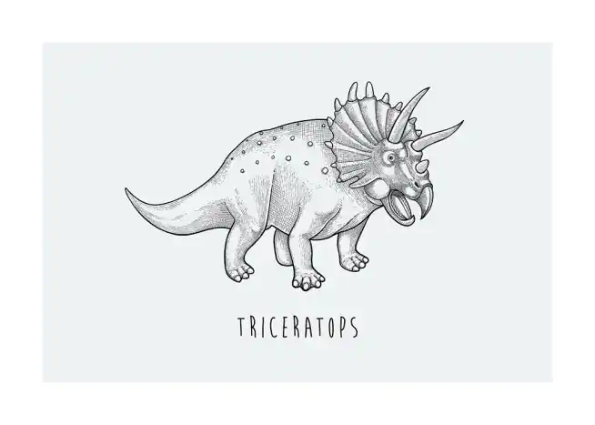

# SMX-SOX

Recursos para el Módulo de Sistsemas Operativos en Red del Ciclo de Grado Medio de Sistemas Microinformáticos y Redes

## Comandos 

	```shell
	pandoc fichero.md -o fichero.pdf --from markdown --template ../rsrc/templates/eisvogel.tex --listings
	```


## Makefile

	Debido a la gran cantidad de unidades y utilidades que se presentan en este repositorio, se ha creado un pequeño Makefile para la ayuda a la generación de los diferentes recursos en PDF, HTML, etc desde Markdown y OrgMode.

## Construyendo con Pandoc

Debido a la gran cantidad opciones y parámetros que se van utilizando en los diferentes ficheros de Markdown. Es necesario instalar en el equipo donde se vaya a generar la documentación en PDF los siguientes paquetes:

* pandoc
* texlive-extra-utils
* texlive-lang-spanish 
* texlive-latex-extra

# Tabla de Valoración

Esta tabla se utilizará para medir la dificultad o la dureza de las tareas y exámenes presentados a largo del temario.


| Valor en la escala | Dinosaurio | Imagen |
| ------------------ | -----------| ------ |
| 0 | Fósil | 
| 1 | Gallimimus |  |
| 2 | Estegosaurio |  |
| 3 | Diplodocus |  |
| 4 | Dilophosaurio |  |
| 5 | Triceratops |  |
| 6 | Ankylosaurio  |  |
| 7 | Pterosaurio | | 
| 8 | Velociraptor | |
| 9 | Espinosaurio | |
| 10 | T-Rex | |
| 11 | Meteorito |  |


