# Instalación y configuración de AD

## Requisitos previos

Contaremos con la guía que vimos en la unidad anterior de instalación de Windows 2019 server, en el caso de que no tengamos instalado el servidor windows.

Los requisitos hardware son los mismos que vimos en las unidades anteriores.

Hay que tener en cuenta que es muy importante que el equipo que vaya a ser el controlador de dominio cuente con una IP estática, ya que todos los otros ordenadores y recursos que utilizaremos en el dominio dependen de que el servidor siempre cuente con la misma IP.

## Cambio de nombre del equipo

Si es necesario cambiar el nombre del equipo a uno que sea fácil de recordar podremos hacerlo desde:

* El administrador del servidor -> _Servidor Local_
* Usando la opción _Sistema -> Configuración avanzada del sistema > Nombre de equipo_

## Configuración de la red

Para las capturas que veréis a lo largo de esta práctica, debéis tener en cuenta que en mi caso la
configuración de la red es:

| Campo | Valor |
| ----- | ----- |
| IP|  192.168.1.59 |
| MASK | 255.255.255.0|
| Gateway | 192.168.1.1|
| DNS Server | 127.0.0.1 |
| DNS Server 2 | 1.1.1.1 |

Vosotros debéis tener clara *vuestra* configuración de la red.

## Configuración del Servidor de Dominio

Una vez configurados el Nombre y la dirección IP del servidor procedemos a instalar los roles respectivos de un controlador de Dominio

## Instalando el rol de Directorio Activo.

Desde el _Administrador del servidor_ seleccionamos la opción _Agregar roles y características_ donde veremos el siguiente asistente, que nos indica que debemos completar antes las tareas que aparecen.

Una vez verificado, seleccionaremos el tipo de Instalación: _Instalación basada en características o roles._

Seleccionamos nuestro servidor (el único).

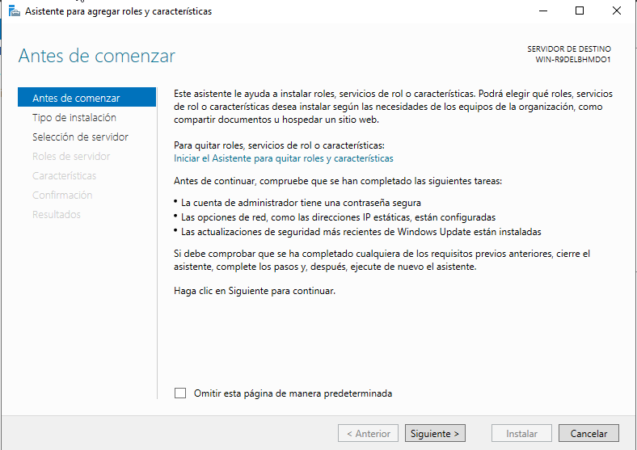\

Seguiremos el asistente y nos instalará todos los roles que hemos seleccionado.

\

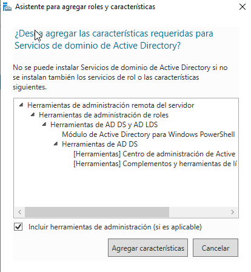\

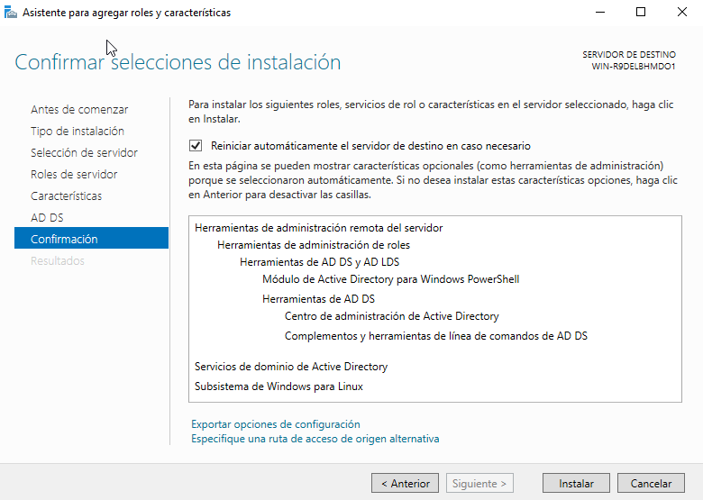\

Una vez se haya instalado los componentes:

*REINICIAD EL EQUIPO*

## Configuración del Directorio Activo

Ahora al reiniciar el equipo deberemos configurar nuestro Dominio.

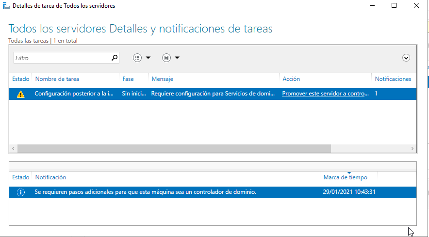\

Seguid los pasos que se muestran en las siguientes capturas:

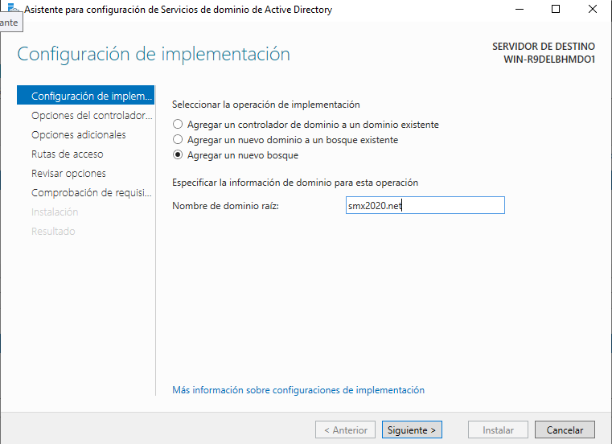\

De contraseña estableced: *Win4dm1n* 

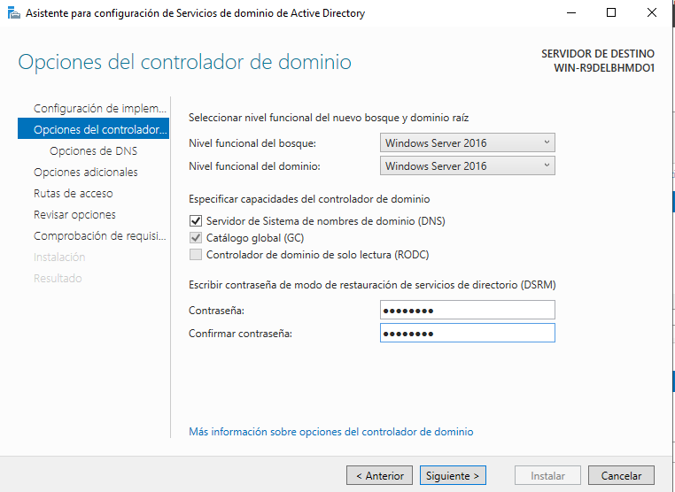\

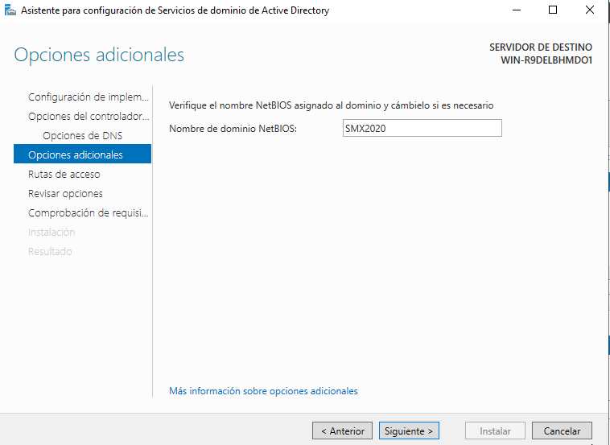\

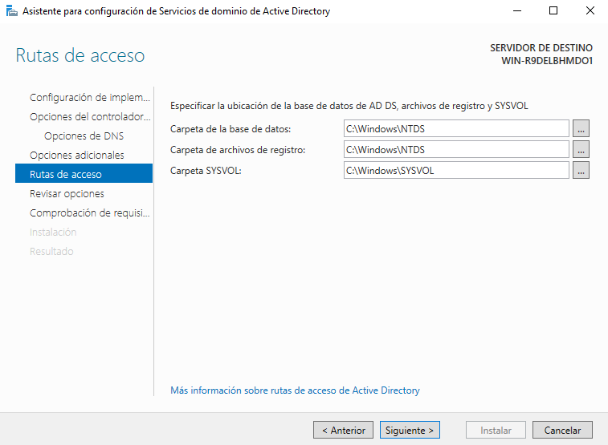\

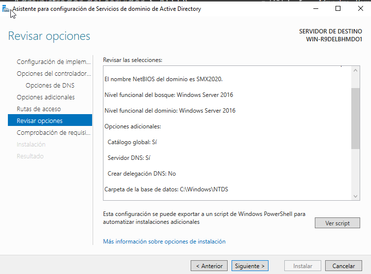\

Aquí podremos guardarnos el **script** de generar via *PowerShell* nuestro Active Directory. Nos lo guardaremos y lo entregaremos en Aules.

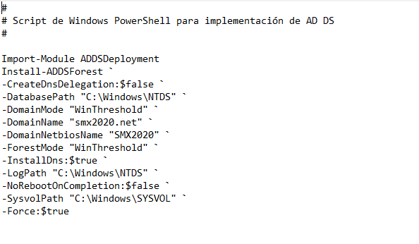\

Reiniciad el equipo

## Creación de usuarios y grupos en Active Directory

Ahora en el menú de Administración del Servidor podéis encontrar el *Centro de Administración del Active Directory*

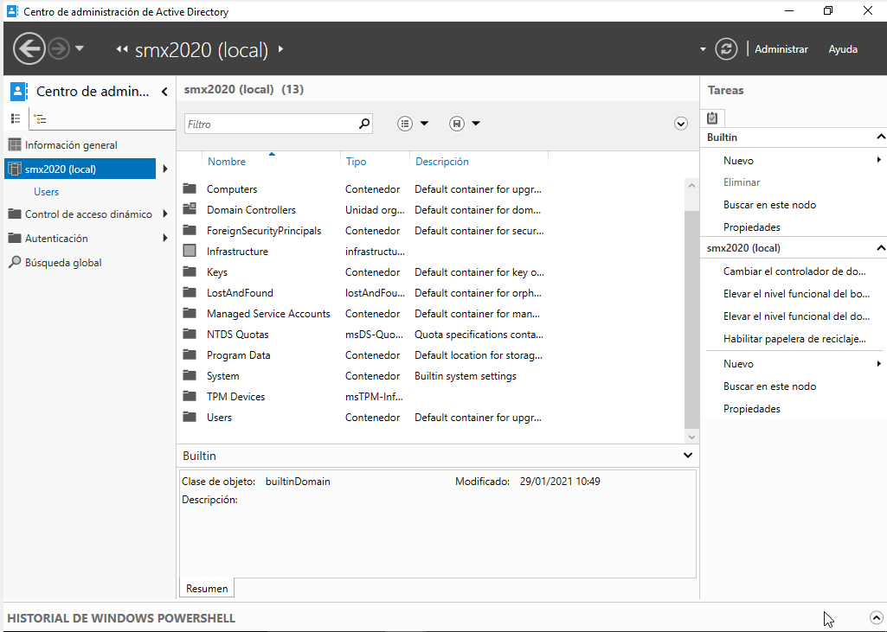\

Cread dentro de *Users* un grupo *Orcos* y 5 Usuarios *orco01, orco02,...*

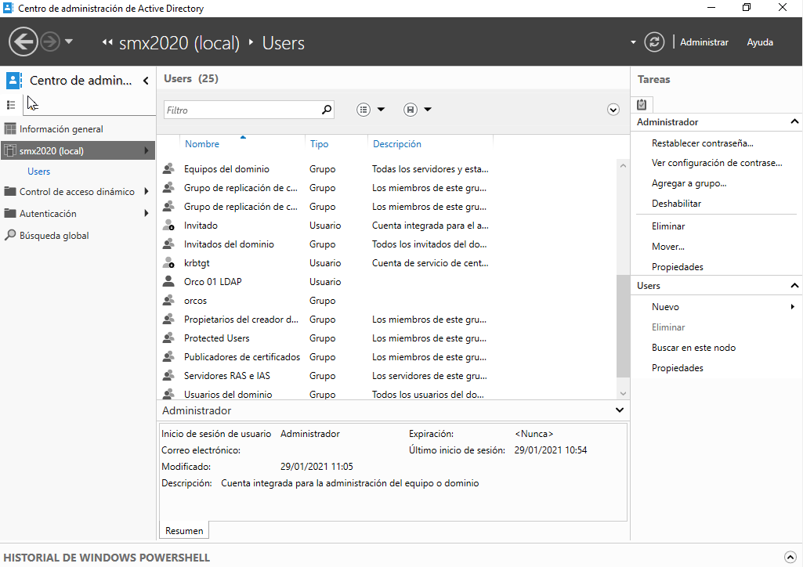\

Seguid los pasos que se muestran en la imagen:

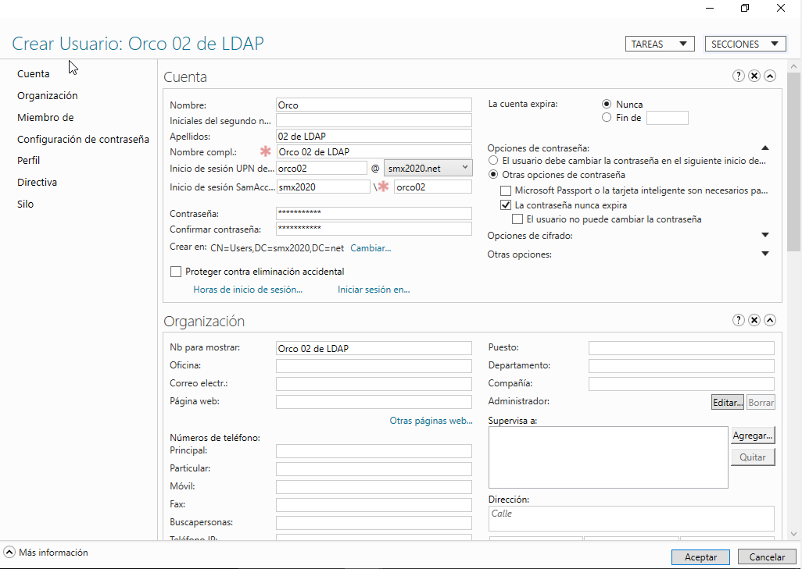\

De contraseña estableced: *Piramide123*.

Añadid los diferentes Orcos al grupo `Orcos`.

\newpage
## Tarea 01 :  Unión al Dominio de Windows 10.

Siguiendo los pasos descritos en este artículo:

https://www.solvetic.com/tutoriales/article/2706-como-anadir-windows-10-en-dominio-windows-server-2019-2016/

Unid la máquina Windows 10 al Dominio recién creado y comprobad que los usuarios *orcos* pueden iniciar sesión.

Avisad al profesor cuando lo tengáis.

# Políticas de Grupo

Las Políticas de Grupo se aplican a los diferentes elementos de un dominio. Existen muchísimas Políticas y muchas vienen ya con un asistente preparado.

Sobre el Directory Activo de Windows 2019 que tenéis montado de la práctica anterior
aplicad a los usuarios Orcos la GPO que se describe en este tutorial respecto 
a que no puedan apagar el equipo.

[ Gestionar GPO en Windows Server 2019](https://www.solvetic.com/tutoriales/article/5403-como-crear-gestionar-gpo-windows-server-2019/)

\newpage
## Tarea 02 : PowerShell

Cread un Script de PowerShell que muestre todas las Políticas de Grupo que se están aplicando en un Dominio. Podéis consultar esta web:

[ Dr.Scripto ](https://devblogs.microsoft.com/scripting/powertip-use-powershell-to-get-a-listing-of-all-gpos-in-a-domain/)

Cuando lo tengáis configurado y funcionando, avisad al profesor para que lo compruebe.

\newpage
## Tarea 03 : GPO + PowerShell

En esta página resumen una serie de comandos muy útiles para trabajar con GPOs desde *PowerShell*.

[ GPO + PowerShell ](https://blog.netwrix.com/2019/04/11/top-10-group-policy-powershell-commands/)

Vamos a comprobar que tal funcionan en nuestro dominio, generad Scripts en PowerShell para resolver cada uno de las siguientes situaciones:

### Script 02

Que pregunte por una máquina del dominio y que genere un informe en *HTML* en 
la carpeta `C:\Reports\Report-$NAMEMACHINE.html` y que lo habra con el navegador de Internet predeterminado.

### Script 03

Que muestre los diferentes `Nombres` y `Logins` de los usuarios que pertenecen al Grupo `Orcos`, creado en la práctica anterior.

### Script 04

Que genere una Política que se llame "Pantallas para Orcos" y que establezca
el tiempo de espera del Salvapantallas a 42 segundos.

\

\newpage
## Tarea 04 : OU en el Active Directory

Cread una OU (Organizational Unit) en vuestro Active Directory que se llame:

- trasgos-de-ALUMNO

donde ALUMNO ha de ser vuestro nombre.

*Realizad una captura de pantalla de la OU Creada* para entregarla en el ejercicio.

\newpage
## Tarea 05 : Script de Creación de Usuarios

Usando el fichero `usuarios-trasgoides.csv` que se adjunta en el ejercicio, preparad un Script en `PowerShell` que lea los diferentes usuarios y los cree en la *OU* que acabáis de crear.

Pistas:

- New-ADUser

El Script ha de llamarse: `reclutador-trasgos.ps1`.

\newpage

## Tarea 06 : Configuración horas de inicio de sesión

Estableced para el usuario: `trasgo13` que solo pueda iniciar sesión desde las 8:00 hasta las 20:00 de Lunes a Jueves.

**Realizad una captura de pantalla donde se muestre la configuración de restricciones**.