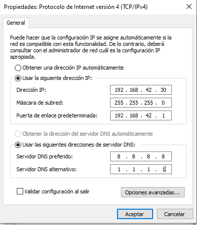

\newpage
# Infraestructura Inicial

Vamos a comenzar repasando los conceptos que vimos a lo largo del curso y vamos a generar una nueva infraestructura para la realización más cómoda de las prácticas.

Para la realización de la recuperación de este módulo, y del módulo de SER
(*Servicios en Red*), utilizaremos 4 Máquinas Virtuales (cómo *mínimo*).

-   Windows 10 - **Client**
-   Windows 2019 - **Server**
-   Xubuntu 20.04 - **Client**
-   Ubuntu Server 20.04 - **Server**

Usuarios Administradores
------------------------
Adjunto tabla resumen de las caracterísiticas de las máquinas.

  Máquina          eths   Disco Duro   Usuario Admin   Password
  ---------------- ------ ------------ --------------- ----------
  Win10-Client     1      50GB         winadmin        Win4dmin
  Windows-Server   1      50GB         winadmin        Win4dmin
  Xubuntu-Client   1      10GB         linadmin        Lin4dmin
  Ubuntu-Server    1      15GB         linadmin        Lin4dmin

Las constraseñas han de ser *estas*.

Todas las máquinas configurar con el parámetro de :
`Usar Cache de E/S del Anfitrion`.

Vamos a utilizar una infraestructura de Red NAT para, que deberemos configurar.

La red NAT ha de llamarse : `NatSOX` y no ha de tener el DHCP activado.

Para ello, se adjunta un script que si lo ejecutamos en Ubuntu creará la Red NAT y la realización de las diferentes redirecciones. En caso de que el anfitrión sea Windows, deberéis ejecutarlo manualmente, es decir crear la Red NAT y la redirección de los puertos de manera manual.

\newpage

```shell
#!/bin/bash

VBoxManage natnetwork remove --netname NatSOX
VBoxManage natnetwork add --netname NatSOX --network 192.168.42.0/24 --enable --dhcp off

VBoxManage natnetwork modify --netname NatSOX --port-forward-4 "ssh-us:tcp:[]:2210:[192.168.42.10]:22"
VBoxManage natnetwork modify --netname NatSOX --port-forward-4 "ssh-uc:tcp:[]:2220:[192.168.42.20]:22"
VBoxManage natnetwork modify --netname NatSOX --port-forward-4 "ssh-wc:tcp:[]:2230:[192.168.42.30]:22"
VBoxManage natnetwork modify --netname NatSOX --port-forward-4 "ssh-ws:tcp:[]:2240:[192.168.42.40]:22"

exit 0
```

Las IPs de las máquinas han de ser:

| IP | Máquina |
|----|---------|
| 192.168.42.10 | Ubuntu Server|
| 192.168.42.20 | Xubuntu Desktop|
| 192.168.42.30 | Windows 10|
| 192.168.42.40 | Windows 2019 Server|

# Configuración de la red en Ubuntu

Configuración en netplan del Servidor

```netplan
# This is the network config written for 
# SOX machines
network:
  version: 2
  ethernets:
    enp0s3:
      dhcp4: no
      addresses: [192.168.42.10/24]
      gateway4: 192.168.42.1
      nameservers:
        addresses: [8.8.8.8,1.1.1.1]
```

Adaptadlo al cliente Xubuntu (también con Netplan)

# Sobre la Instalación de Windows 10

Para la correcta configuración y puesta en marcha de Windows luego más
adelante, debéis utilizar la versión **Pro**, ya que será la que nos
permitirá realizar las funciones de *Unión al dominio*, *creación de
usuarios*, etc.

La configuración de la red en Windows ha de ser así (adaptando la IP para el server):

\

# Sobre la Instalación de Ubuntu Server

Debido a que los Sistemas Operativos de Servidores suelen no tener
disponible un acceso gráfico, a lo largo del curso vamos realizar todas
las configuraciones sobre **Ubuntu Server** mediante la línea de
comandos.

Tareas como la ejecución de comandos, copiar y pegar desde internet,
etc. Lo resolveremos mediante `SSH` u otras herramientas parecidas.

Si para *estar más cómodos* realizamos este tipo de acciones, no estamos
siendo especialmente *profesionales*.