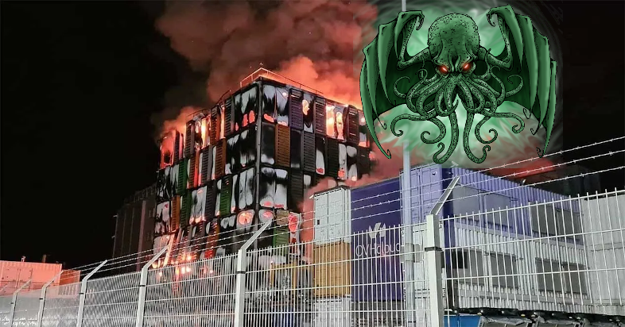
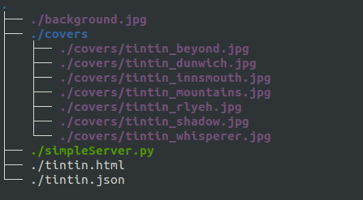

# Tintín Meet's Lovecraft Missions - Lore

En esta serie de Misiones diseñadas para enfrentar a los investigadores a peligros cada 
vez más importantes, el autor se ha tomado la libertad de ambientarlas en un Universo de
Crossovers entre los Primigenios y una serie de personajes de la cultura **Pop** de todos los tiempos.

Espero que sean de su agrado.

\

# Mission 01 : La editorial maldita

A lo largo de las aventuras de nuestro héroe especial, se ha ido enfrentando a una serie de peligros que por suerte han sido recogidos en una seríe de *volúmenes* que cuentan sus asombrosas aventuras (aún a riesgo de perder la cordura).

Los volúmenes está preparados, impresos y listos para su distribución, sin embargo un extraño incidente en la sede de *OVH* (Observatorio Vírico Holístico), ha hecho perder todos los datos de la página Web. Se sospecha que todo esto a sido obra de los acólitos del *Simulacro de Sedefkar*, los esquivos *Hermanos de la Piel*, pero esto no nos debe preocupar ahora mismo, debemos centrarnos en restaurar la página Web de la editorial y permitir que los volúmenes se distribuyan por el mundo, contando la verdad acerca de los Primigenios y sus Cultos.

\

## Partes de la misión

El bibliotecario *Ah'Berlan-Ash* ha guardado en su guarida secreta un Zip que contiene lo que se ha podido rescatar de la Página Web de la editorial, así cómo un video que muestra *como debería quedar* la página cuando esté plenamente restaurada.

Podéis encontrar el Zip en :

- [Ah'Berlanas-Ash Enlace](http://aberlanas.ovh/coachez/mision01.zip)

Dentro podréis encontrar esta estructura:

\

- `background.jpg` ha de establecerse como fondo de la página Web.
- La carpeta `covers` contiene las portadas de los volúmenes.
- `simpleServer.py` es una ayuda a los investigadores que al ser *invocado* desde la poderosa *línea de comandos*, pone en marcha un pequeño servidor Web en el puerto *8080*
- `tintín.html` contiene la estructura HTML y un script en JS que debe ser modificado (sólo el script de JS, el HTML debe dejarse cómo está no se puede TOCAR NADA), para que se comporte cómo se pide. Se recomienda tocar lo menos posible del Script y *deducir* qué falta para que todo funcione como toca. 
- `tintin.json` contiene la información de los diferentes volúmenes que debe ser mostrada en la Web. Se debe usar *tal y cómo se suministra*.

