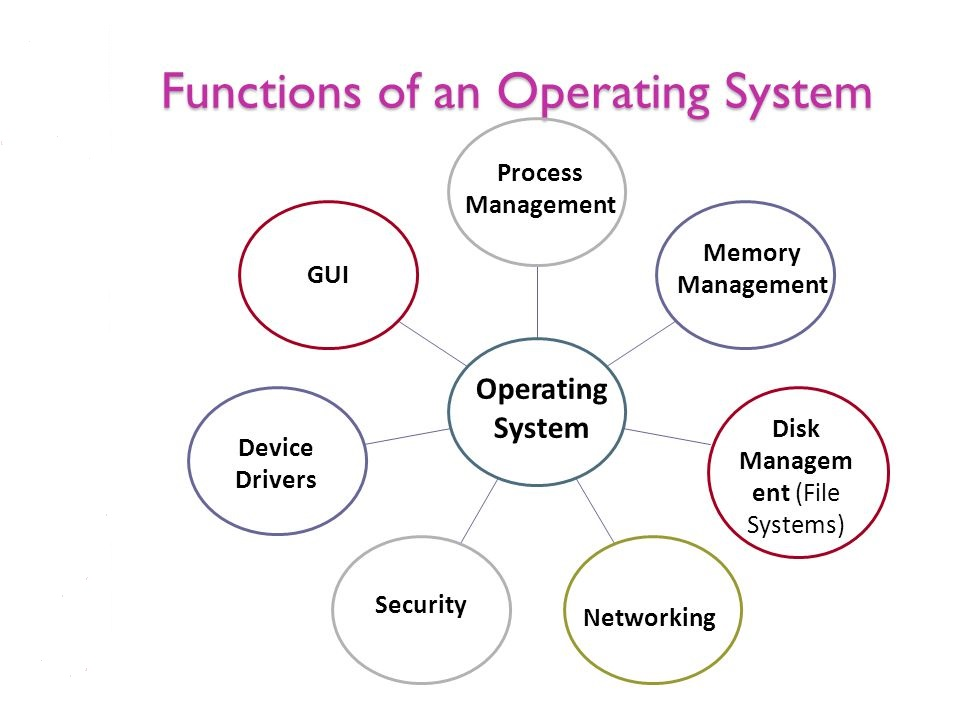

# Task 01 : Why is Virtualization Useful?

Read carefully the text and answer the questions after.

The text is extracted from the VirtualBox manual.

As you read the text, write down in a table the words that you do not know their meaning (before you search it!)

- Words that *you can intuit their meaning from the context*.

- Words you *don't know what they mean*.

| *Intiuting* | Unknowing | 
| --       |    --       |
|          |             |

\newpage

## Text from VirtualBox

The techniques and features that Oracle VM VirtualBox provides are
useful in the following scenarios:

-   **Running multiple operating systems simultaneously** Oracle VM
    VirtualBox enables you to run more than one OS at a time. This way,
    you can run software written for one OS on another, such as Windows
    software on Linux or a Mac, without having to reboot to use it.
    Since you can configure what kinds of virtual hardware should be
    presented to each such OS, you can install an old OS such as DOS or
    OS/2 even if your real computer\'s hardware is no longer supported
    by that OS.
-   **Easier software installations** Software vendors can use virtual
    machines to ship entire software configurations. For example,
    installing a complete mail server solution on a real machine can be
    a tedious task. With Oracle VM VirtualBox, such a complex setup,
    often called an appliance, can be packed into a virtual machine.
    Installing and running a mail server becomes as easy as importing
    such an appliance into Oracle VM VirtualBox.
-   **Testing and disaster recovery** Once installed, a virtual machine
    and its virtual hard disks can be considered a container that can be
    arbitrarily frozen, woken up, copied, backed up, and transported
    between hosts. On top of that, with the use of another Oracle VM
    VirtualBox feature called snapshots, one can save a particular state
    of a virtual machine and revert back to that state, if necessary.
    This way, one can freely experiment with a computing environment. If
    something goes wrong, such as problems after installing software or
    infecting the guest with a virus, you can easily switch back to a
    previous snapshot and avoid the need of frequent backups and
    restores. Any number of snapshots can be created, allowing you to
    travel back and forward in virtual machine time. You can delete
    snapshots while a VM is running to reclaim disk space.
-   **Infrastructure consolidation** Virtualization can significantly
    reduce hardware and electricity costs. Most of the time, computers
    today only use a fraction of their potential power and run with low
    average system loads. A lot of hardware resources as well as
    electricity is thereby wasted. So, instead of running many such
    physical computers that are only partially used, one can pack many
    virtual machines onto a few powerful hosts and balance the loads
    between them.

\newpage

## Questions.

1.  ¿What is the meaning of the sentence: *ship entire software
    configurations*.?
2.  Explain in your own words the sentence : *a virtual machine and its virtual hard disks can
    be considered a container that can be arbitrarily frozen, woken up,
    copied, backed up, and transported between hosts*.
3.  On the last point (*Infraestructure consolidation*), explain in 
    Spanish why the Virtualization Environments could reduce the energy 
    spend in machines.
4.  Attach the table with the words.

# Task 02

See the following image and put examples of mechanisms (at least 2) of each sphere in the operating systems you know:

*Could be GUI or CLI*.

\

