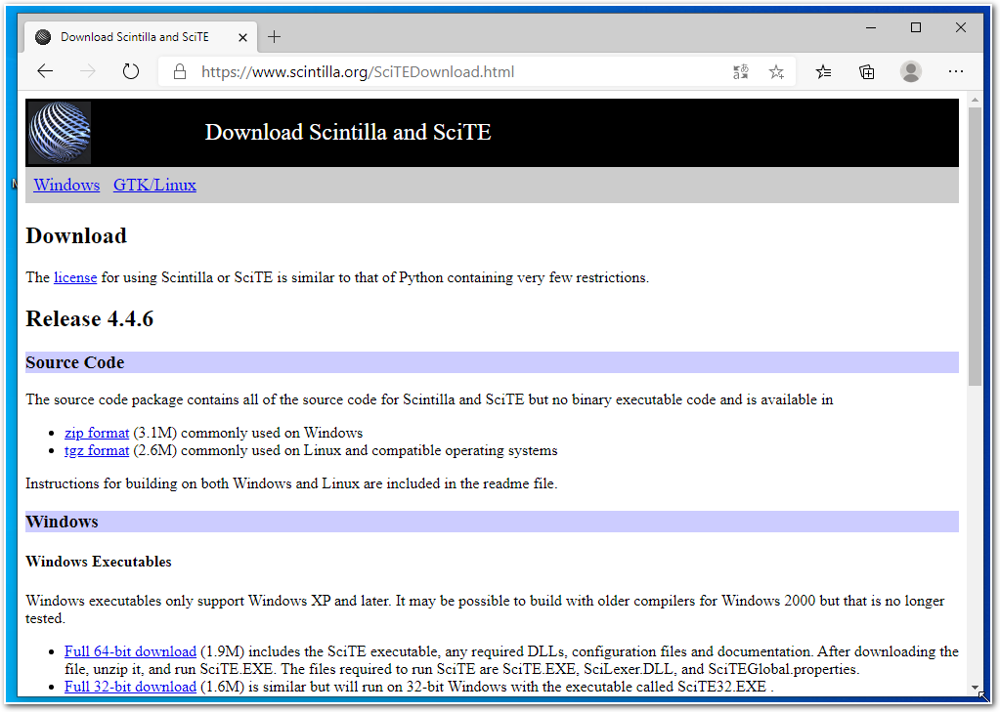
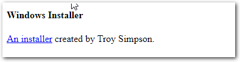
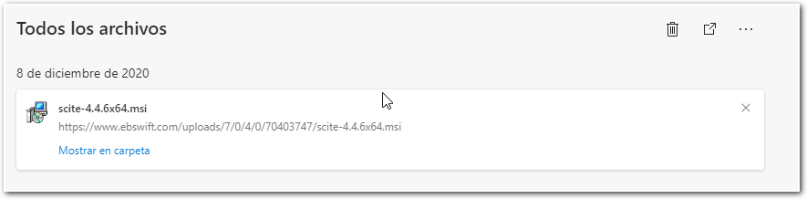
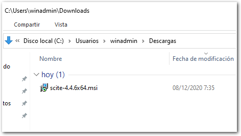

# Software Managers and Installers - MSI

In this practice we are going to see how to install an * unattended * way
Software on Windows using a Microsoft Installer Package. 
We will see that a *log* of all the operations that are
are carried out as they occur, in such a way that we can
serve to collect this information for iagnosis.

# SciTe Installation

`MSI` (or *Microsoft Software Installer*) is a *framework* for
installation that allows us to program the operations that must be
performed to install in a Microsoft Operating System certain Software. 

The options offered vary between the different versions, but there are many common ones.

For this practice we have chosen **SciTe**, a small editor of Text of which I am quite a fan.

## Step 01 : Download the Software
---------------------------------

Look for it at the official page

Once there we look for an *Installer* since we do not want a
*self-executing*.

It links us to the website of a partner who has prepared an `msi` for
be able to install. There we look for our *system architecture* and
we download. 

If we are downloading it from a Microsoft browser we will have to accept a series of messages until we have it in
our `Downloads` folder.

Now that we have it in our downloads folder and once we have
made sure that we have downloaded the correct file (*showing the
extensions for known file types*). 

And we go to work now with `PowerShell`.

\newpage

## Step 02 : PowerShell

Once in the `Downloads` folder we are going to run the installer, but
adding the `/ h` parameter to the execution prompt.

Using the **ancestral technique** of **Comprehensive Reading** seek
the necessary parameters in order to:

\

- It is installed without asking the user for assistance, but indicating that it is
    going to install.
- Save * the detailed information of the installation * in a
    file that is called: `scite-log.txt` that is saved in the folder
    `Downloads`.
- Let the teacher know when you have it.

\newpage

# Step 03 : Configuration for Scite

## Previous step

* Install FiraCode font in Windows.
* Install OpenSans font in Windows.
* Install Roboto font in Windows.
* Install Mozilla Firefox.

## The task

Using the Scite User Properties File, configure the Scite for:

* Use a Monospaced FiraCode font in `code` of the same size.
* Use a OpenSans or Roboto font in *Comments* of the same size.
* Show always the line numbers.
* Show always the spaces and tabs.
* Show always the toolbar.
* Open the Open-File dialog with the filter "All files" by default.
* Configure for open the firefox when you *compile* an `.html` file.
* Let the teacher know when you have it.

# What I need to upload to Aules?

In a `tar.gz` or zipfile, you must upload:

- The file `scite-log.txt` created.
- The Scite User Properties file.

