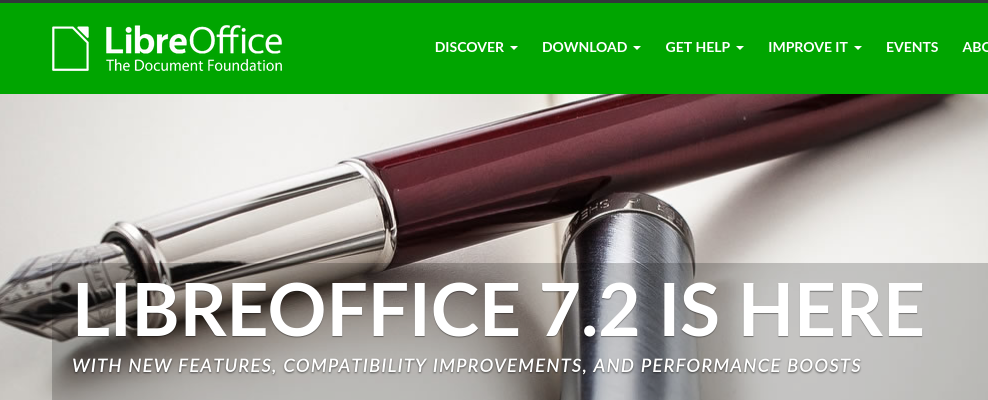
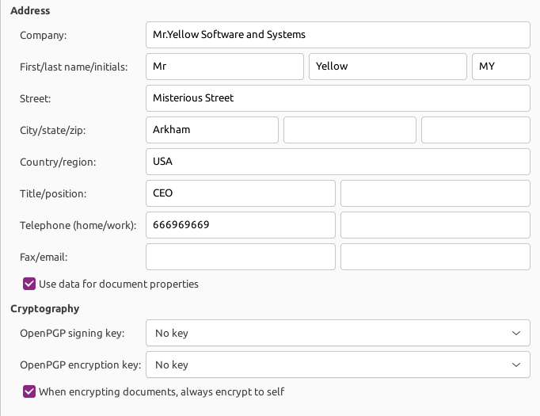

# Introduction

At our enterprise: *Mr.Yellow Software and Systems*, we need to install some kind of **office suite**, for example LibreOffice.

\

LibreOffice offers several apps which can work together in order to allow their users the work with documents, spreadsheets, etc.

Is usual at enterprises that you need some kind of customization for this *suits*, like :

- Custom signatures.
- Custom templates.
- Custom galleries.
- ...

In our enterprise we need (for now), a simple customization:

- Our signature in the document metadata.
  
\

And we need to develop a lot of documentation for a the Slovenian Government, to make our job in an elegant form, we need to check the word mistakes. 

# Task 01

Install in our Windows 10 environment the LibreOffice 7.2, from the *Official Page* 

- [LibreOffice](https://www.libreoffice.org/)

Configure the Signature for the *windadmin* user and install the language support for:

- English (United Kingdom).
- Spanish (Castilian).
- Catalan.
- Slovenian.

Configure the default language for documents to : *Slovenian*. And enable the spell checker for this language.

Let the teacher know when you have it.

# Task 02

When you use a Word, sentence, etc. which not appears at the dictionary, you can add to the "personal" dictionary, in order disable the **annoying underline**.

Add the next words to the `standar.dic`:

- Arkham.
- Miskatonic.
- Cthulhu.

And code a PowerShell script that looks in the USER HomeFolder and make a copy of the standar.dic file for this user at the `Desktop` folder with the date of the current day.

For example, if we run today (03/10/2021) the script with the user: **winadmin**, the script must copy the `standar.dic` file from the user configuration and store it with the name: 20211003-standar.dic at the `Desktop` folder of the user.

