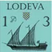

# Introduction

This task is designed to remember some basic concepts about the filesystems.

\

*Warning to Seafarers*

`PATHS`, `URLS` and common stuff for scripts could be placed as the first lines of the scripts, in order to stablish at the beginning the 
values and be ready to be changed if the **sysadmin** needs.

# Concept : Absolute PATH

What is an absolute PATH? Is a PATH in a FileSystem that includes every folder needed to achieve the file/folder. This PATH will be valid from every folder of the System.

## Task 01 

- Write a Shell Script that test if the PATH given as the first argument is ABSOLUTE in GNU/LinuX environments.
- Write a PowerShell Script that test if the PATH given as the first argument is ABSOLUTE in Windows environments.

# Concept : Relative PATH

What is a Relative PATH? Is a PATH that includes the information to achieve other file/folder from a specific place in the filesystem.

## Task 02

- Write a Shell Script that test if the PATH given as the first argument is RELATIVE and achieve some file or folder in GNU/LinuX environments.
- Write a PowerShell Script that test if the PATH given as the first argument is RELATIVE and achieve some file or folder in Windows environments.

## Task 03 

- Mix the Scripts in order to make the both tests in GNU/LinuX and Windows.
- Extend the funcionality given the next information to the user:
  - The file/folder exists.
  - Is a file and the current user has reading permissions.
  - Is a file and the current user has writing permissions.
  - Is a file and the current user has executing permissions.