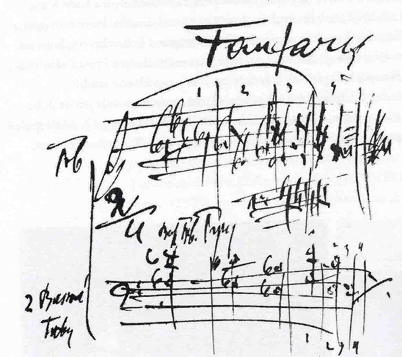
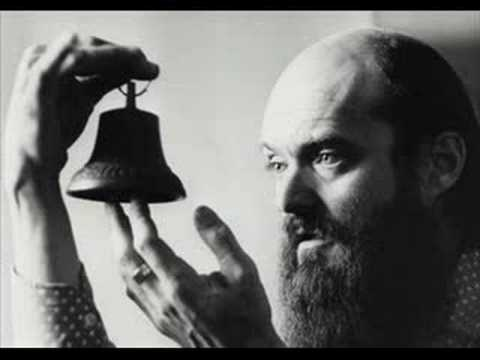
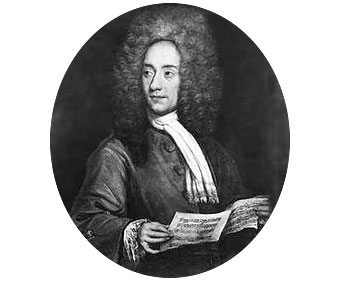

A Night At The Opera
============================

*Welcome Citizens to a MAGICAL NIGHT...*

\

You have just been promoted, hired or however you want to see it, but It turns out that right now we are working for the *Philharmonic Orchestra from Budapest*.

As soon as the director arrives, he tells you that they have a big problem ... They computerized the music stands and now everything is a **chaos**, the musicians are lost, we need order, know what scores are of each one, see the instrument groups and also ... everything has to be arranged as soon as posible.

The *Grand Prince* will attend the concert that will start the tour throughout the country of the *Budapest Philharmonic Orchestra*.

The situation is as follows, we have a series of instruments (*users*) and a series of folders on the lecterns (`/srv/sox/`) that
they contain the scores of the works to be performed. But one misfortune has happened, one of the musicians (or several), they are very clumsy with the new lecterns ... accidentally they enter where they should not and they start to interpret what is wrong ... *EVERYTHING IS CHAOS!*.


\newpage


\

*Warning to Seafarers*

I would like to emphasize that the completion of this task will be
demanding with the following aspects:

- That you are able to read a * long * sentence and know how to extract *what it demands to be done*.
- That you handle the routes (absolute and relative) with accuracy and taking seriously what you are doing. If you create the wrong routes, it will not work (a **0** in that section).
- What do you check what is being asked of you, changing user and seeing that the problem raised is resolved (access permissions, writing, etc).
- Each work will be evaluated in an *isolated* way.
- I am aware that I pose challenges that you do not know *a priori* but you can count with me in class if you have any questions.
- As you use commands, I advise you to write them down, now that will come out later.
- If someone *makes witchcraft* or *plagiarice * I'll know.


\newpage

# Users

The users that we must create or verify that they are in the system are
the following:

- piccolo
- clarinet
- horn
- trunk
- fiddle
- viola
- cello
- doublebass
- battery
- xylophone
- conductor

# Groups

And the groups of an orchestra are the following:

- strings
- woodwind
- metalwind
- percussion
- conductor
- orchestra

\newpage

The instruments of the Orchestra are divided into several groups, as is displayed in the next table:

  Instruments    strings      woodwind     metalwind      percussion   conductor   orchestra
  ------------- --------- --------------- -------------- ------------ ----------- -----------
  piccolo                     X                                                    X
  clarinet                    X                                                    X
  horn                                        X                                    X
  trunk                                       X                                    X
  fiddle            X                                                              X
  viola             X                                                              X
  cello             X                                                              X
  doublebass        X                                                              X
  battery                                                    X                     X
  xylophone                                                  X                     X
  conductor                                                              X         X


## Task 01

Code a Shell Script in GNU/LinuX that add the users and grous needed to configure the environment.
Explain the lines of the script which set the password for the users in a *unattended* way.

\newpage

ACT I : Overture
-----------------

\

The next concert has a program of 4 works that are:

- The Great Gate of Kiev: Folder `/srv/sox/TheGreatGateOfKiev`
- The Blue Danube: Folder `/srv/sox/BlueDanube`
- The New World Symphony: Folder: `/srv/sox/NewWorldSymphonie`
- The Jazz Suite: Folder `/srv/sox/TheJazzSuite`

In each of these folders will be the scores of each of the
previously described instruments, which we'll *simulate* for now with
`.txt` files that will contain the name of the instrument and their names must be their own names.

To make it even clearer:
For the user `fiddle` in the work of *The Great Gate of Kiev* (`/srv/sox/TheGreatGateOfKiev/`) must exists
a file called `fiddle.txt` and the content of the file must be the name of the user (`fiddle`).

At the beginning the conductor fears why not
let's get there in time for the performance ...

What he demands is:

1. Each instrument can read and write *only* on its score.
2. Each group of instruments can *read* those of its group, but not *write*.
3. The conductor can *read and write* all the scores (because is the conductor).

## Task 02

Code a Shell Script named "act01.sh" with the orders needed. Using a variable to store the PATHS and using loops could be a good idea.

## Viewer User

So that viewers can see what is the *concert program*,
it has been thought that a user `spectator` is created and
configure SSH access to the machine from the lecterns to display the
*Program*.

For the configuration of this user `spectator`, you must configure
the **OpenSSH Server Service**, as required for compliance
the requirements:

- Before asking for the *password* of the users, it must show a
    `Banner` that indicates that we are connecting with the **Server** of the
    Orchestra.
    Attached is the **banner** file in practice,
    `banner-orchestra.txt`, you must place it in the`/etc/`folder and
    modify the corresponding directive.

- In the event that the user `spectator` starts session (*login*),
    you must do a default and unique action:
    * Show the content from the `/srv/sox/` folder that will contain the different works, as
    a list of the musical *program*.

    We attach a screenshot of how it could look.

\

\newpage

ACT II : Andante
-----------------



It seems that the orchestra is beginning to working up with the new music stands ... and for
the second act the director wants to be able to do more things than before...

The routes are still in `/srv/sox/` but not to lengthen more than necessary statement are omitted.

The program for Act Two is:

- The Sinfonietta of *Janacek* (`Sinfonietta`)
- Saturn from *The Planets* of *Holst* (`Saturn`)
- The Unfinished Symphony of *Schubert* (`Unfinished`)
- The Ride of the Valkyries by *Wagner* (`Valkyries`)

In this second act the director needs some details, above the following is added:

1. That each instrument can read and write *only* on its score.
2. That each group of instruments can *read* those of its group, but not *write*
3. The conductor can *read and write* all the scores (because is the conductor).
4. The Wind on Saturn groups need to be able to make annotations (*write*) in your group. This prevails over the above.
5. In the Unfinished all the scores of the instruments that begin with the letter **v** must be able to be executed by *Others*.
6. In all the scores of the cavalcade of the Valkyries must be the phrase will appear:

    `The swift Indian bat happily ate cardillo and kiwi, while the stork played the saxophone behind the straw hut .... 0123456789`

    and in addition the director must be able to *read, write and execute*.

7. The Sinfonietta must contain an additional score, which will be will named: `TheSilencio.txt` and it should belong to anyone.

## Task 03

Code a Shell Script named "act02.sh" with the orders needed. Using a variable to store the PATHS and using loops could be a good idea.

# ACT III: Adagio




Seems that the orchestra is beginning to working with the lecterns, the
administrator, and with the permissions.

We are about to do the best show that the Orchestra has never seen. We have presented two
quite moved acts, with works of great intensity, but now,
reflecting on what we have learned and present to listeners pieces that invite to reflection and inner calm.

The program for Act Three is:

- The Nocturns of *Chopin* (`Nocturns`)
- Fratres from *Arvo Part* (`Fratres`)
- The Adagio of *Albinoni* (`Adagio`)
- De Profundis by *Arvo Part* (`DeProfundis`)

The conductor is increasingly convinced that it was a good decision
hire you ... but he wants to make sure. He demands for the following:


1. That each instrument can read and write *only* on its score.
2. That each group of instruments can *read* those of its group, but not *write*
3. The conductor can *read and write* all the scores (because is the conductor).
4. In the **Nocturns** he wants to change the last modified date up to date `01/01/1977` in ** all ** the scores.
5. In **Fratres** all users must be able to create new files, but all of them (the new ones) must belong to the group *orchestra*, these files will be created on live !, so it is not worth changing permissions *"a posteriori "*. The mechanism set must change those permissions when creating the files **in a automatic** way.
6. After the Fratres difficulty, ... the **Adagio** must contains a folder where only the conductor could creates files and these belong to the group *orchestra*.
7. In the **De Profundis** by *Arvo Part* you want that each one of the scores, in addition to its original content contain:

    - The numerical identifier of the owner. (id)
    - The main group identifier of the owner. (gid)

    Example, in the file `fiddle.txt` it should appear:

```shell
fiddle
1007
1007
```

    In the case that `1007` is the UID of the fiddle user.

## Task 04

Code a Shell Script named "act03.sh" with the orders needed. Using a variable to store the PATHS and using loops could be a good idea.


\

\newpage

# ACT IV: Solemn Finale

We are already at the end of the tour, and the director is much more than
happy with us. We have a few days left before they hire us definitely or they fire us with boxes out of temper.

The conducto prepares the last concert with the following works:

- The Gallop of Guillermo Tell de *Rossini* (`Gallop`)
- Oh Fortuna by Carmina Burana by *Carl Orff* (`Carmina`)
- The 1812 Solemn Overture of *Tchaikovsky* (`1812`)

What do you need?

1. That each instrument can read and write *only* on its score.
2. That each group of instruments can *read* those of its group, but not *write*
3. The conductor can *read and write* all the scores (because is the conductor).
4. In the **Gallop** the files of the group *Strings* must contain instruments belonging to that group.
5. In **Carmina** the conductor's file must be the
    ** CONCATENATION ** of the rest of the files of the work (fiddle.txt,
    viola.txt, ...).
6. In the **Solemn Overture (1812)** we must make each of the
    instrument scores will contain **in addition to** the text that
    always contain, the *History* of the orders that the
    user owner of the file. (Hint: **history**).

## Task 05

Code a Shell Script named "act04.sh" with the orders needed. Using a variable to store the PATHS and using loops could be a good idea. The members of groups must be extracted dynamically.
