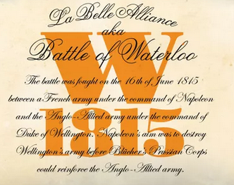
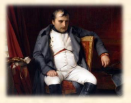
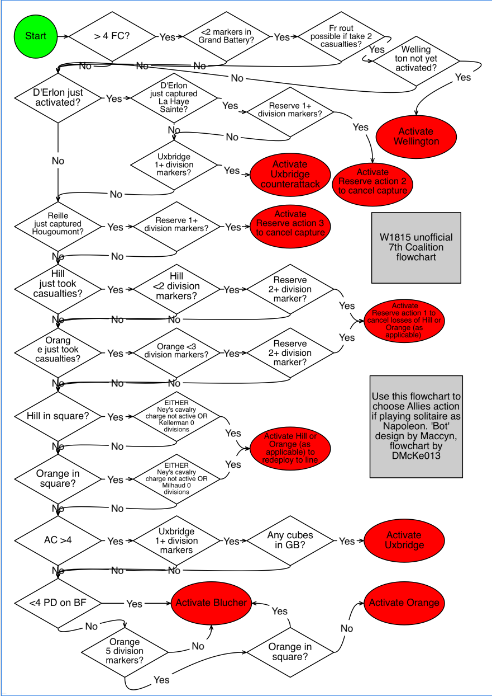

# Introduction

One of the most famous client of our enterprise is Our  Brigadier General-Engineer Angel, and is a big fan of Boardgames and Wargames.

In the World of Wargames, exists a lot of divisions and subdivisions :

- Wargames from the Ancient World.
- Wargames about Romans.
- Wargames about Medieval.
- Wargames about the Second World War.
- And a lot of periods more.

One of the most typical periods is Napoleonic Wars, a 20 years period that involved the powder and the horsemen.

From this period, one introductory game could be **W1815**, *La Belle Alliance*. And the Brigadier needs our help.

\

# Squizo and Bot

We need to develop a BOT (coded in *python, PowerShell or BASH*), that assists the Brigadier to test his habilities as a General.


\


What is a **BOT**? A bot in Boardgames, is a logic system (tree of decisions), that could be followed by the players in order to *simulate* the
intelligence and decisions like a *human*. The idea is let the human player spend his/her intellectual effort in his/her actions, not taking all the decisions from the game (*squizo mode*).

The idea is develop a Bot that will play as **Wellington**.


\


\newpage

The logic is the next:

## Unofficial W1815 7th Coalition ‘bot’

When playing as Napoleon, follow this chart to ‘choose’ the 7th coalition action.

- **Paragraph 1**: If >4 French Casualties and <2 cubes in the Grand Battery and French rout would be possible if two casualties are taken and Wellington not yet used then ACTIVATE WELLINGTON. If not, go to **Paragraph 2**.
- **Paragraph 2**: If D’Erlon captured La Haye Sainte in the French Phase and Reserve has >0 division markers then ACTIVATE RESERVE ACTION 2. If not, go to **Paragraph 3**.
- **Paragraph 3**: If D’Erlon activated in the French Phase and Uxbridge has >0 division markers then ACTIVATE UXBRIDGE COUNTERATTACK. If not, go to **Paragraph 4**.
- **Paragraph 4**: If Reille captured Hougoumont in the French Phase and Reserve has >0 division markers then ACTIVATE RESERVE ACTION 3. If not, go to **Paragraph 5**.
- **Paragraph 5**: If Hill is in square and was not attacked by cavalry in the last French activation and Reille has >2 division markers, then activate Hill to redeploy to line. If not, go to **Paragraph 6**.
- **Paragraph 6**: If Hill took casualties in the French Phase and Hill has <2 division markers remaining and Reserve has >1 division markers remaining then ACTIVATE RESERVE ACTION 1 to cancel Hill’s losses. If not, go to **Paragraph 7**.
- **Paragraph 7**: If Orange took casualties in the French Phase and Orange has <3 division markers remaining and Reserve has >1 division markers remaining then ACTIVATE RESERVE ACTION 1 to cancel Orange’s losses. If not, go to **Paragraph 8**.
- **Paragraph 8**: If Hill is in square and either Ney’s cavalry charge is not active or Kellerman has 0 division markers then ACTIVATE HILL TO REDEPLOY TO LINE. If not go to **Paragraph 9**.
- **Paragraph 9**: If Orange is in square and either Ney’s cavalry charge is not active or Milhaud has 0 division markers then ACTIVATE ORANGE TO REDEPLOY TO LINE. If not go to **Paragraph 10**.
- **Paragraph 10**: If total Allied Casualties >4 and Uxbridge has >0 division markers and >0 cubes in the Grand Battery then ACTIVATE UXBRIDGE. If not go to **Paragraph 11**.
- **Paragraph 11**: If <4 Prussian Divisions on the battlefield then ACTIVATE BLUCHER. If not go to **Paragraph 12**.
- **Paragraph 12**: If Orange has 5 division markers and is not in square then ACTIVATE ORANGE. If not ACTIVATE BLUCHER.

\newpage

\

# Task 01

Code a ShellScript, that asking the questions, offers the logic and say the actions that the player must obey. The Brigadier give us some code:

```shell
#!/bin/bash

# Some Values
FC=0
WELLINGTON_ACTIVATED=false
RESERVES=4
GRANDBATTERY=3
action="none"

echo " * Welcome to W1815 - a SMX Bot "

while [[ $action != 'q' && -n $action ]]; do

    read -p " French Casualties are greater than 4?" answerFC

    # Follow the gaps
    # PUT THE BOT LOGIC HERE
    #


    echo " **** **** "
    echo "Waiting for the next Wellington Turn, press q to quit"
    echo "press another key to make the bot take the decision"
    read -p " * Action : " action

done

echo " * Thanks for using the Bot"


exit 0


```
