NFS y Sistemas de ficheros Remotos
==================================

En esta práctica vamos a configurar el Servicio de ficheros NFS en
nuestro Servidor Windows

1.  

**NFS** son las siglas de Network FileSystem (Sistema de Ficheros en
Red), que es uno de los más populares sistemas de compartición de
archivos. Es muy famoso y para tod\@s los curiosos se trata de un
*protocolo a nivel de aplicación* (OSI).

Para la realización de esta práctica deberemos comprender desde el
primer momento:

-   ¿Qué estamos configurando?
-   ¿Tenemos clara la arquitectura *Cliente-Servidor*?

Una vez tengamos estos puntos aclarados, vamos a ir por los diferentes
pasos:

Práctica
========

Paso 01 - Instalación del Servicio NFS en Windows 2019
------------------------------------------------------

Al igual que en la práctica anterior ahora debemos instalar el servicio
de NFS en nuestro servidor Windows. Para ello seguiremos los pasos
descritos a continuación:

Iremos a la **Administrador del Servidor**.

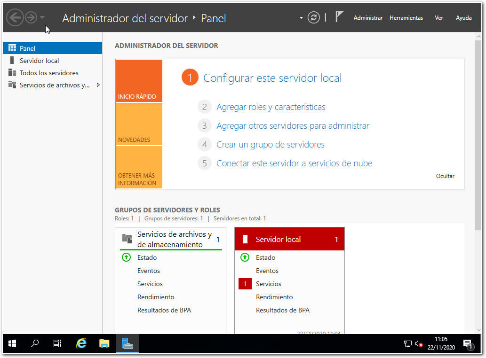

Y seleccionaremos la Opción de **Agregar Roles o Caracterísiticas**

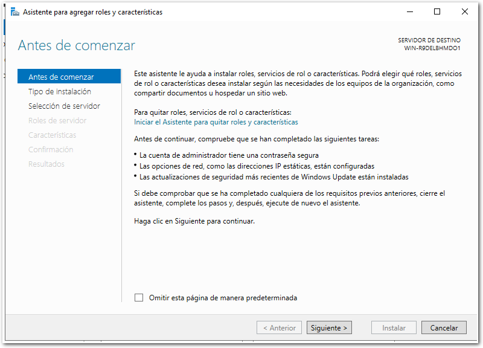

Seleccionaremos la **Instalación basada en características o roles**.

Marcaremos para instalar en nuestro servidor (esta ventana será muy útil
más adelante, pero por ahora...)

Y seleccionaremos los Roles adecuados

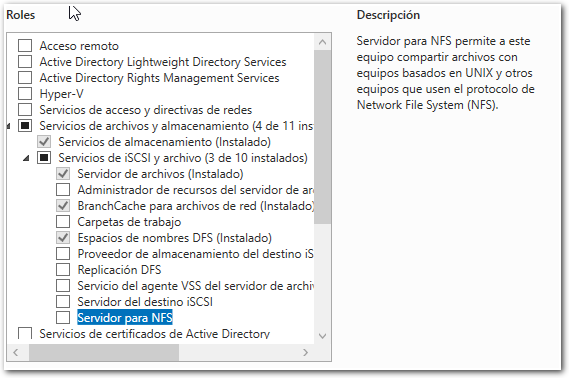

No seleccionaremos nada más por ahora

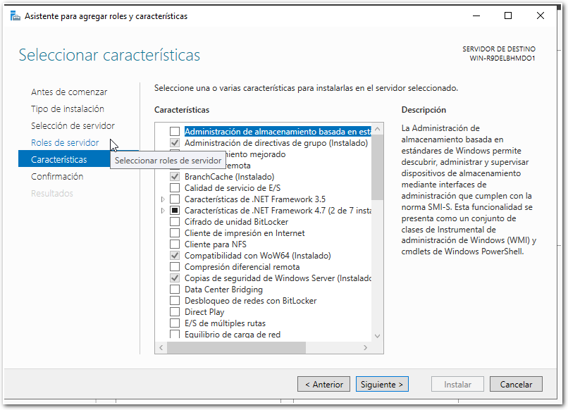

En la ventana de confirmación le indicaremos que reinicie si es
necesario.

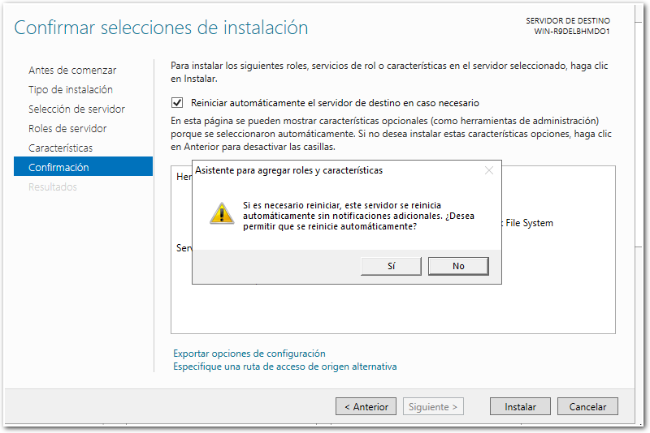

Si todo va bien se mostrarán la siguiente ventana:

Con esto ya tendremos el servicio NFS instalado en nuestro Servidor
2019.

Paso 02 - Configuración del Servicio NFS en Windows 2019
--------------------------------------------------------

Ahora vamos a configurar las carpetas que deseamos que se configuren
como posibles puntos de montaje por parte de los equipos de la red.

Por ahora configuraremos para que una determinada carpeta:

`C:\Compartido-Win-NFS`

quede accesible para todos los equipos de la red. En este primer momento
no vamos a prestar demasiada atención a la autenticación de usuarios (al
igual que hicimos con Ubuntu). Más adelante iremos *afinando* más las
carpetas compartidas.

**Objetivo** : Exportar C:\Compartido-Win-NFS en **Solo léctura** para
todos los equipos de la red.

Para ello seguiremos los pasos siguientes:

-   En el apartado de **Administrador del Servidor** podemos ver que
    aparecido un nuevo subapartado:

    **Servicios de archivos y recursos compartidos**

    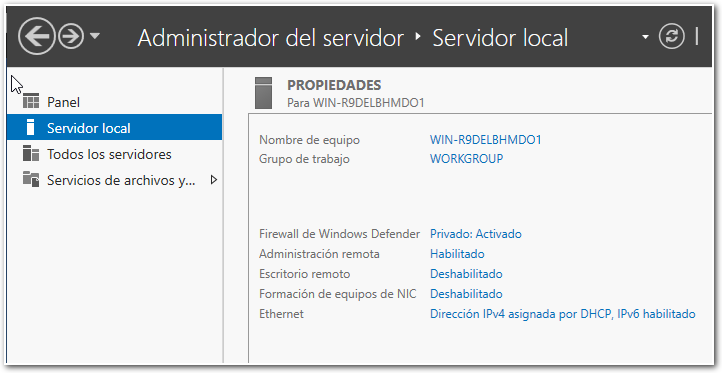

-   Si entramos dentro vemos que aparece de nuevo un árbol de opciones,
    nos dirigiremos a **Recursos compartidos**

    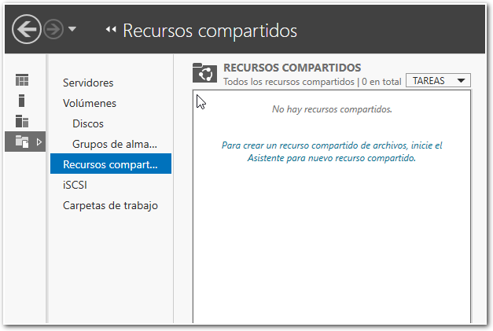

    Seguiremos el asistente para crear un nuevo recurso.

    En esta práctica estableceremos la opción *NFS-Rápido*.

    

    En la ubicación del recurso compartido deberemos marcar la opción de
    *Ruta de acceso personalizada*.

    Crearemos una carpeta en la ruta `C:\Compartido-Win-NFS\` y la
    seleccionaremos

    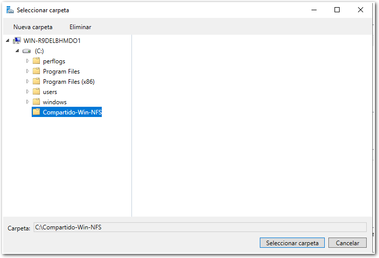

    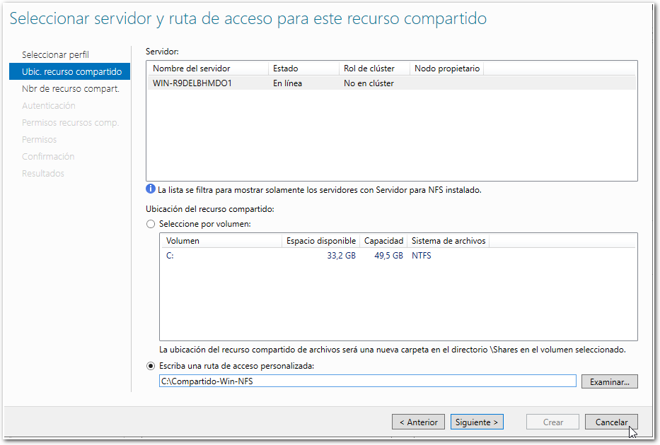

    En la siguiente pantalla estableceremos el nombre del recurso
    compartido

    

    En este punto estableceremos la seguridad de la carpeta exportada.
    En esta práctica por ahora estableceremos que no necesitaremos
    autenticación en el servidor para poder montar la carpeta por NFS.

    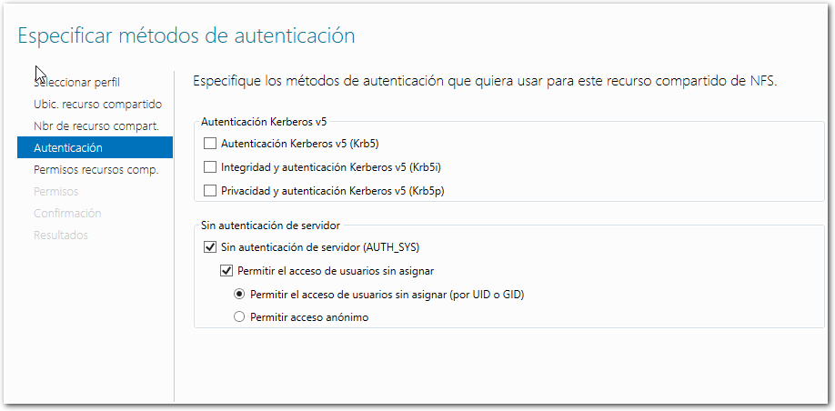

    En el siguiente diálogo estableceremos que *todas* las máquinas
    podrán leer tan solo las carpetas y los ficheros exportados.

    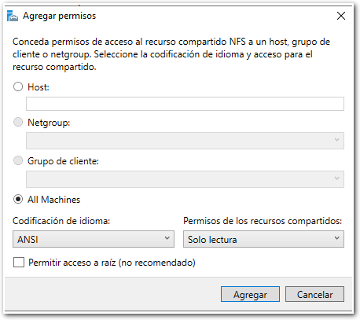

    Podríamos añadir más permisos, pero para la prueba inicial es
    suficiente.

    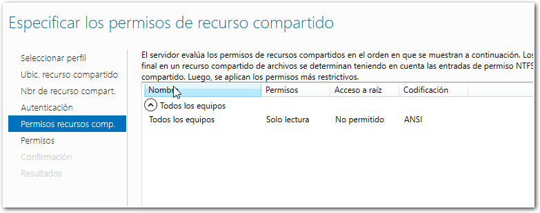

    Dejaremos los permisos tal y como vienen por defecto.

    

    Se muestra el diálogo de confirmación.

    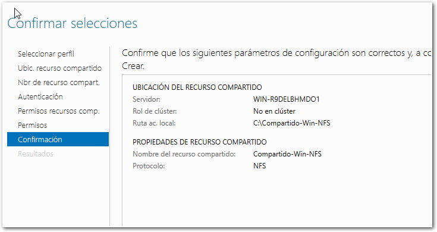

    Al aplicar se muestra el proceso de aplicar los cambios.

    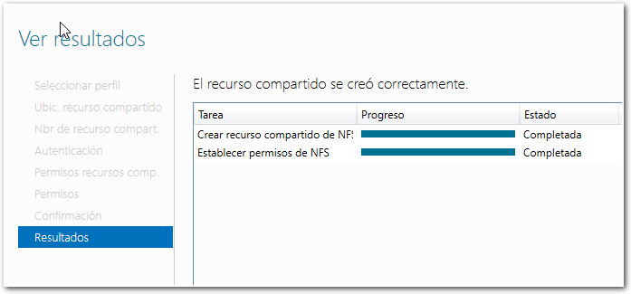

    Si ahora navegamos por la estructura de ficheros podremos observar
    que la carpeta `C:\Compartido-Win-NFS` está siendo compartida y el
    explorador de ficheros (`explorer.exe`) nos lo indica.

    

    Creemos unos pequeños ficheros a modo de prueba para comprobar más
    adelante que la carpeta está siendo montada.

    

Paso 03 : Montando desde Ubuntu
-------------------------------

Necesitaremos los mismos programas que en la práctica anterior y los
pasos son los mismos.

Crearemos el punto de montaje:

-   `/client/compartido-win-nfs/`

Una vez creado probaremos a ejecutar, el comando `mount`.

Y comprobaremos que funciona de manera correcta:

Ejercicios
----------

1.  Sigue los pasos indicados para crear el mismo punto de montaje que
    se ha visto en la práctica. Avisa al profesor cuando lo tengas.

2.  Configura otra carpeta : `C:\Compartido-Win-NFS-Secreto` que tan
    solo sea accesible desde la IP de tu cliente Ubuntu, y monta el
    Sistema de Ficheros en Lectura y Escritura. Comprueba que funciona
    todo. Avisa al profesor cuando lo tengas.

3.  Si en el fichero compartido del ejemplo escribimos carácteres con
    tíldes cuando lo mostramos desde los Sistemas GNU/LinuX los
    carácteres no se ven bien. ¿Serías capaz de arreglarlo?.
