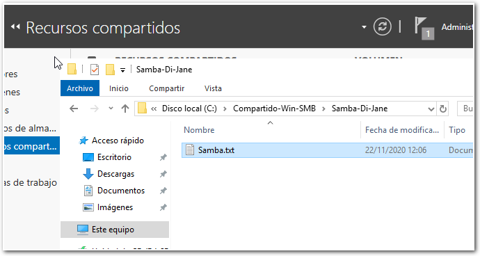
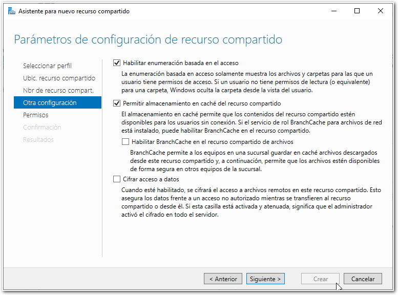
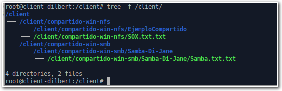

SMB y Sistemas de ficheros Remotos
==================================

SMB (*Server Message Block*) es otro de los sistemas de compartición de
archivos en redes mixtas más famosos y utilizados del mundo. En la
implementación de este protocolo en *GNU\\/LinuX* se decidió por el
nombre de `samba`.

Para realizar la configuración del servidor seguiremos muchos de los
pasos descritos en la práctica anterior. Tan sólo aparecerán en esta
práctica los pasos que se han considerado más relevantes y/o diferentes
respecto al asistente que hemos visto en la práctica del **NFS**.

Para la realización de esta práctica deberemos comprender desde el
primer momento:

-   ¿Qué estamos configurando?
-   ¿Tenemos clara la arquitectura *Cliente-Servidor*?

Una vez tengamos estos puntos aclarados, vamos a ir por los diferentes
pasos:

Práctica
========

Paso 01 - Instalación del Servicio SMB en Windows 2019
------------------------------------------------------

El servicio SMB ya viene instalado por defecto en Windows 2019.

Paso 02 - Configuración del Servicio NFS en Windows 2019
--------------------------------------------------------

Ahora vamos a configurar las carpetas que deseamos que se configuren
como posibles puntos de montaje por parte de los equipos de la red.

Por ahora configuraremos para que una determinada carpeta:

`C:\Compartido-Win-SMB\Samba-Di-Jane\`

quede exportada para los equipos de la red si conocen la contraseña y el
usuario de Administración. Más adelante veremos cómo se integra todo
esto con el *Directorio Activo*.

Para ello seguiremos los pasos del asistente anterior, pero
seleccionaremos *SMB (Rápido)*.

En la ventana de parámetros de configuración de recursos compartido
seleccionaremos las opciones que se muestran en la imágen siguiente:

Una vez tengamos la carpeta estando servida por parte de nuestro
Servidor Windows. Toca la configuración del cliente.

Paso 03 - Configuración del Cliente SMB en Ubuntu 20.04
-------------------------------------------------------

Lo primero será realizar la instalación en el cliente de las utilidades
**CIFS** para poder realizar las operaciones de montaje de los sistemas
de ficheros remotos que están siendo servidos por parte del servidor.

`apt install cifs-utils`

Una vez tenemos las utilidades instaladas, vamos a escribir un fichero
de credenciales que utilizará el sistema de montaje para *autenticarnos*
en el servidor cuando arranque.

Un buen lugar donde establecerlo es en la carpeta personal del usuario
que deseamos que monte. En este caso cómo es `root` y `root` es un tanto
especial, estableceremos el fichero en `/root/.credentials`.

El contenido deben ser los datos necesarios para iniciar sesión en la
máquina remota para montar la Unidad (en mi caso el usuario
Administrador).

`$ cat /root/.credentials`

    username=Administrador
    password=Win4dm1n
    domain=WORKGROUP

Por ahora dejaremos `WORKGROUP` aunque más adelante veremos la utilidad
de esto con los diferentes directorios activos.

Una vez tengamos el fichero creado y con los permisos adecuados: 0600.

`$ chmod 0600 /root/.credentials`

`\newpage`{=latex} Estableceremos en el `fstab` que se monte
automáticamente al iniciar sesión.

He separado por líneas el `fstab` para facilitar la lectura, pero todos
los parámetros han de estar en la misma línea (como siempre).

    # <file system>
    //192.168.1.59/Compartido-Win-SMB    

    # <mount point>
    /client/compartido-win-smb    

    # <type>
    cifs   

    # <option>
    credentials=/root/.credentials    

    # <dump> <pass>
    0   0

`\newpage`{=latex}

Deliveradamente el creador de la guía (*evil laugh*) ha omitido algo en
la configuración del **cliente** que no permitirá que realicéis la
práctica cómo si fuera un tutorial.

Una vez hayáis establecido la configuracíón en el fichero `/etc/fstab` ,
deberéis ejecutar el comando `sudo mount -a` e investigar lo que ocurre
hasta que funcione.

Aquí se pondrá en juego mucho de lo aprendido.

Una vez realizado el montaje de manera correcta, si realizamos ahora un
`tree  -f /client/` se mostrará algo similar a esto:

No olvidéis comentar la línea del `fstab` cuando acabe la práctica y la
haya revisado yo, para que no de problemas más adelante.

`\newpage`{=latex}

Ejercicios
----------

1.  Seguir los pasos y cuando lo tengáis funcionando avisadme.

2.  Configurar una carpeta adicional en el servidor SMB:
    \"`C:\Compartido-por-Goblins`\" y cread un usuario \"goblin\" que
    pueda leer y escribir en ella. Cread otro punto de montaje en el
    cliente:

    `/client/goblins-bailongos/`

    Y estableced que sea el usuario `goblin` en el arranque el que lo
    monte (al igual que antes \"Administrador\"). Cuando lo tengáis
    funcionando, avisadme.

