SMB y Sistemas de ficheros Remotos
==================================

En esta práctica vamos a configurar el Servicio de ficheros SMB en
nuestro Servidor Ubuntu y montaremos las carpetas compartidas en Windows
10.

Además utilizaremos SMB para compartir una impresora *PDF* en nuestro
Ubuntu para los equipos Windows. Estableciendo que los ficheros impresos
aparezcan en la carpeta compartida en el usuario que lo imprime.

SMB (*Server Message Block*) es otro de los sistemas de compartición de
archivos en redes mixtas más famosos y utilizados del mundo. En la
implementación de este protocolo en *GNU\\/LinuX* se decidió por el
nombre de `samba`.

Algunos enlaces de interés para el *netplan*

[Netplan](https://ubuntu.com/blog/ubuntu-bionic-netplan)

Práctica
========

Paso 00 - Asegurarnos de la conectividad
----------------------------------------

El primer paso en esta práctica es comprobar que tenemos en el cliente y
en el servidor las IPs que corresponden y que tenemos conectividad entre
ellos.

Servidor Ubuntu:

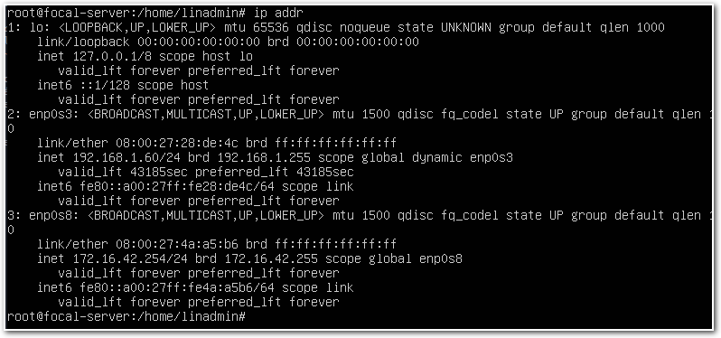

También nos aseguraremos de que Windows 10 es capaz de contactar con el
servidor Ubuntu. (`ping ubuntusrv.smx2021.net`).

\newpage

Paso 01 - Instalación del Servicio SMB en Ubuntu Server
-------------------------------------------------------

Realizaremos la instalación del Servicio de Samba en Ubuntu Server.

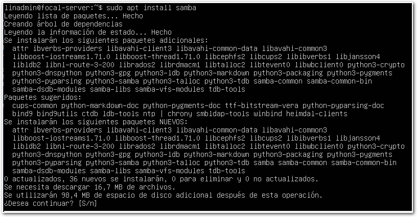

Este servicio proporcionará las herramientas para compartir en redes
mixtas una serie de recursos desde Máquinas GNU/LinuX. En esta práctica
utilizaremos este servicio para compartir:

-   Carpetas.
-   Impresoras.

`\newpage`{=latex}

Paso 02 - Configuración de la carpeta en el servidor.
-----------------------------------------------------

Ahora vamos a configurar las carpetas que deseamos que se configuren
como posibles puntos de montaje por parte de los equipos de la red.

Por ahora configuraremos para que una determinada carpeta:

`/srv/samba-shared-from-linux`

Se comparta y esté accesible para los equipos de la red. Para ello, una
vez creada, editaremos el fichero de configuración del servicio para
añadir la siguiente sección.

*NOTA:* Se trata de un inifile.

`/etc/samba/smb.conf`

*NOTA:* $\rightarrow$ *No confundir con el fichero: `/etc/smb.conf` que
es el del cliente.*

Crearemos una sección al final que contendrá las siguientes líneas:

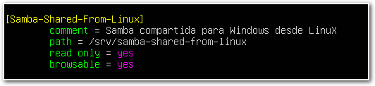

Le indicaremos al Firewall (si lo tenemos activo) que permita las
conexiones a los puertos de Samba:

Establecemos los permisos correctos en la carpeta y copiamos un fichero
para luego poder comprobar que tenemos acceso a él desde el cliente.

Crearemos ahora al usuario `goblin` en local y en samba.

  User     Password
  -------- ----------
  goblin   G0bl1n

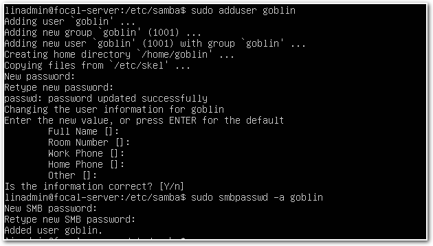

`\newpage`{=latex}

Paso 03 - Configuración de la carpeta en el cliente Windows.
------------------------------------------------------------

Una vez realizado todo esto, arrancaremos la máquina Windows 10 y una
vez comprobado que tenemos conexión, lanzaremos el menú de ejecutar :
*Win+R* y escribiremos la IP del servidor de Ubuntu (si todo va bién,
veremos que él mismo ofrecerá los diferentes recursos para
*autocompletar*).

- `\\IP_DEL_SERVIDOR\`

o 

- `\\NOMBRE_DEL_SERVIDOR\`

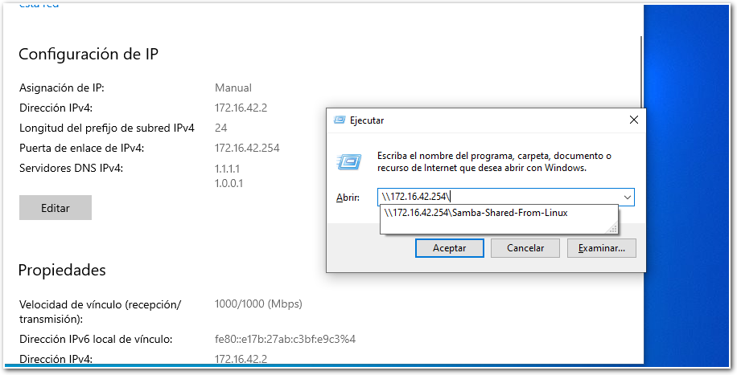

Al darle a *Aceptar* veremos algo similar a esto:

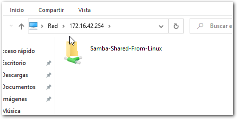

Al hacer clic nos pedirá autenticación. *No marquéis \"Recordar mis
credenciales\"*.

Ahora ya podremos comprobar que podemos ver el contenido de la carpeta
compartida.

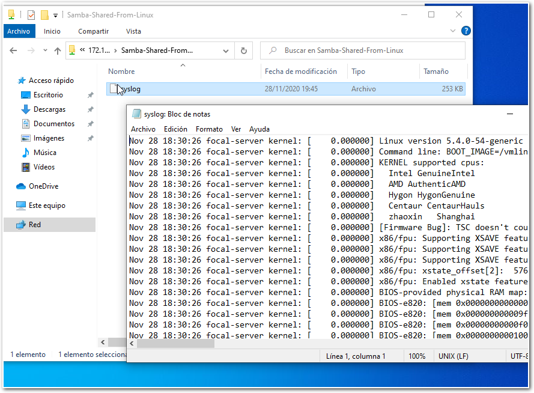

`\newpage`{=latex}

Paso 04 - Configuración de CUPS-PDF en el Servidor
--------------------------------------------------

*CUPS* es el servicio de impresión más famoso del mundo. No es objetivo
de esta práctica profundizar en el mismo, pero sería interesante que
buscárais información por vuestra cuenta y tratárais de configurar
diferentes opciones.

Vamos a configurar en el servidor una impresora que lo que hace es que
cuando se utiliza de manera *normal* genera un fichero *PDF* con lo que
sería los elementos impresos. Esto ahora está siendo implementado *por
defecto* por parte de muchos Sistemas Operativos, pero nos sirve como
servicio *complejo* y sin duda en la configuración aprenderemos mucho.

El primer paso será instalarlo:

`$ sudo apt install cups-pdf`

Una vez configurado iremos al fichero de configuración de
`cups-pdf.conf` en `/etc/cups/` y lo que haremos será alterar el
comportamiento habitual y establecer que el fichero generado por los
usuarios estára en la carpeta que acabamos de compartir.

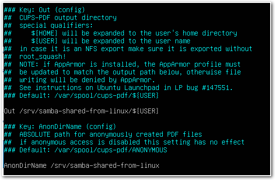

Una vez tenemos esto correctamente configurado, reiniciamos el servicio.

`\newpage`{=latex}

Paso 05 - Configuración de Samba para Imprimir
----------------------------------------------

Ahora configuraremos Samba para que permita la impresión desde los
equipos de la red, para ello editaremos el fichero de configuración de
Samba y nos aseguraremos de que está todo cómo se muestra en la imágen.

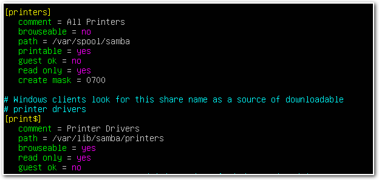

Reinciamos el servicio y mediante el comando `smbclient` comprobamos
**qué recursos** están siendo compartidos.

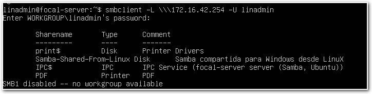

`\newpage`{=latex}

Paso 06 - Conexión de la impresora desde el cliente
---------------------------------------------------

Ahora volveremos a Windows 10 y en el apartado de recursos compartidos
que hemos visto antes (`\\IP_SERVIDOR\`), comprobaremos que también nos
aparece nuestra impresora `pdf` compartida.

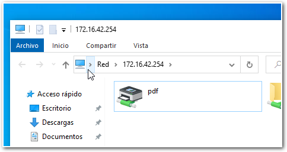

Nos conectaremos a ella y seleccionaremos el Driver de \"text only\" que
aparece en el listado.

Abriremos el `notepad.txt` y escribiremos un pequeño texto para realizar
una prueba.

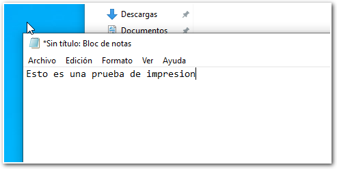

Y lo imprimiremos en nuestra *Impresora compartida*.

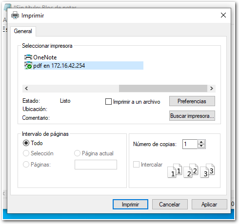

Veremos que *NO APARECE EL FICHERO en nuestra carpeta compartida*. :-(

`\newpage`{=latex}

Paso 07 - Investigando el problema.
-----------------------------------

Nos ponemos ahora en modo *Investigador* y deberemos resolver este
problema. ¿Qué ha pasado? ¿Dónde está el problema?

Os voy a contar cuales han sido mis pasos mentales.

-   Windows no ha dado ningún aviso, tan solo \"no aparece\" el fichero
    en la carpeta.

-   Voy al servidor a ver si se ha dejado de compartir o algo similar.
    Todo ok.

-   Abro el syslog del servidor para ver los mensajes...y ahí aparece...

    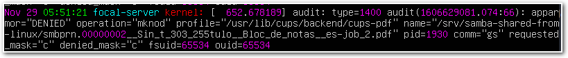

La ruta está bien, pero no ha podido escribir...porque al utilizar la
tecnología babilónica de *leer* el servicio `apparmor` no nos ha dejado.
El caso es que... ahora al pensar...¿hemos visto esto antes?

Pues sí. En el fichero de configuración de `cups-pdf`.

Si seguimos las pistas, nos veremos editando el fichero:

Y al final editaremos el fichero para que se ajuste a nuestras
necesidades:

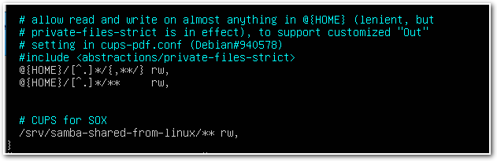

Vamos a reiniciar el servicio...

Y ahora al imprimir....¡ *et voilà* !

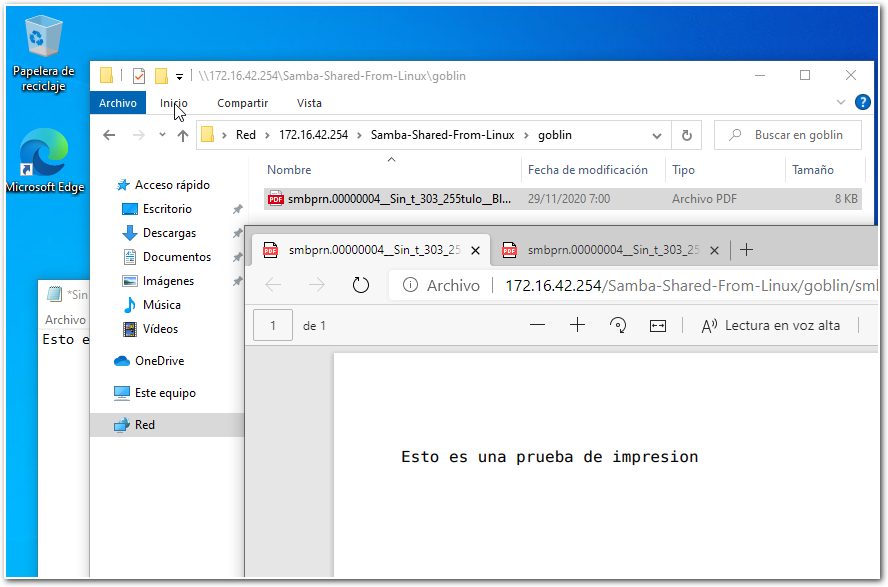

`\newpage`{=latex}

Ejercicios
----------

1.  Seguid los pasos y cuando lo tengáis funcionando avisadme.

2.  Cómo habéis visto la sincronización entre los diferentes usuarios de
    Samba y de GNU/LinuX no existe, es decir, la estamos creando
    artificialmente. Esto no es especialmente útil. Ya que por ejemplo
    ahora, si quísieramos añadir al usuario `orco` para que pudiera
    imprimir, deberíamos hacerlo tanto en local cómo en Samba (tal y
    como hemos hecho antes con `goblin`.

    Además, si un usuario cambia su contraseña (por política de la
    empresa, por ejemplo). Deberíamos ir \"actualizándola en todos los
    subsistemas\". Esto no es profesional ni viable en una empresa.

    Así que, siguiendo los pasos que se describen aquí:

    [Samba-Securing](https://ubuntu.com/server/docs/samba-securing)

    Configurad Samba para que utilice los usuarios y los passwords del
    Sistema y no los mantenga aparte.

    Para comprobarlo, cread luego un usuario orco (sólo en el Sistema
    `/etc/passwd` ), con el password:

      Usuario   Contraseña
      --------- ------------
      orco      0rc0++

    Y desde Windows autenticaros con ese usuario para montar e imprimir.
    Mostrádmelo.

