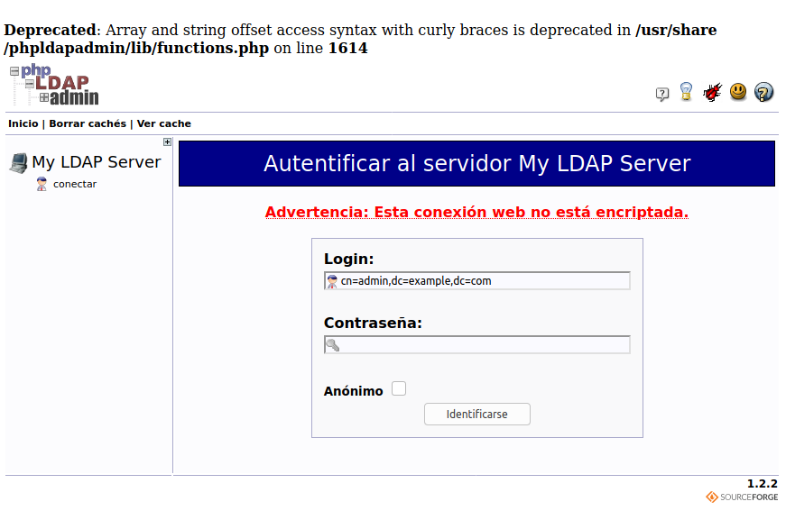
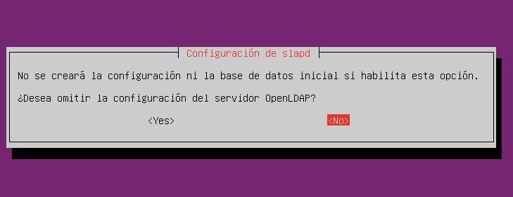
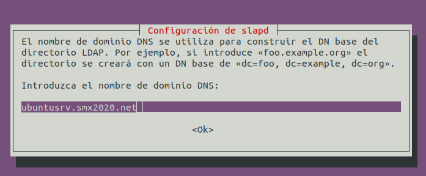
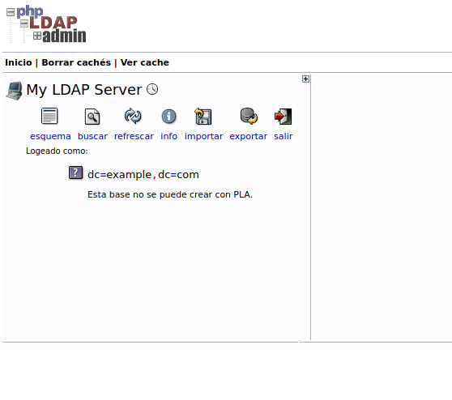
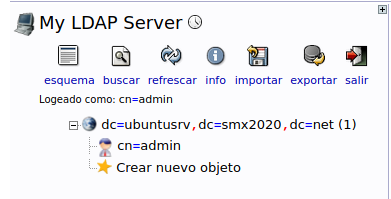
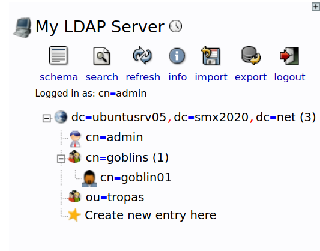

Tarea: Instalación de OpenLDAP
==============================

Vamos a realizar ahora la instalación y posterior configuración del
servicio de OpenLDAP. El objetivo es preparar una máquina con GNU/LinuX
para que funcione como servidor de LDAP en el que almacenaremos los
usuarios y los grupos a los que asignaremos más adelante diferentes
permisos y configuraciones sobre recursos de nuestra red.

Existen muchos servidores OpenSource de LDAP, pero uno de los más
famosos es OpenLDAP, que será el que instalaremos y configuraremos en
esta práctica.

Instalación del servicio
------------------------

\<\<\<\<\<\<\< HEAD En la máquina Ubuntu server que tenemos,
instalaremos el paquete `slapd` que `=====` En la máquina Ubuntu Server
que tenemos, instalaremos el paquete `slapd` que \>\>\>\>\>\>\>
9c441ef3ff022815cfc89b6236cf4e515e8eb3b9 contiene el *demonio* o
servidor de ldap.

\
La orden que ejecutaremos es :

``` {.example}
sudo apt install slapd
```

Durante la instalación nos preguntará por la contraseña del
administrador del LDAP (no tiene por qué ser la misma que la del
administrador *local* de la máquina, pero en esta práctica *sí* que
usaremos el mismo: **Lin4dm1n**)

OpenLDAP no tiene una configuración especialmente amigable para el
usuario, así que lo que haremos será instalar un pequeño gestor Web que
nos permite via navegador administrar el LDAP si conocemos la IP (O el
nombre) de nuestro servidor.

Este tipo de herramientas son especialmente útiles en entornos
empresariales, ya que nos permite administrar de manera remota cualquier
servicio, utilizando herramientas gráficas, sin necesidad de instalar un
servidor de X en las máquinas que contienen dichos servicios.

Buscaremos en los repositorios una herramienta que nos permita
administrar el `LDAP`.

``` {.example}
sudo apt search ldapadmin
```

Vemos que aparece el `phpldapadmin` pero esto requiere de un servidor de
bases de datos para gestionarlo, así que antes de que nos pongamos a
instalar y configurar el Slapd, vale la pena instalar el MySQL Server.

Instalación de MySQL Server
---------------------------

Aquí hay que instalar el servicio de Mysql.


Una vez instalado , continuamos con el `phpldapadmin`.

Instalación de phpldapadmin
---------------------------

Entre los resultados seleccionaremos el paquete `phpldapadmin` que entre
sus dependencias cuenta con un servidor web (el *apache*) con el que
podremos conectarnos a nuestro LDAP *local* desde cualquier máquina de
la red que esté accesible y administrar el servicio.

Accediendo a phpLDAPadmin
-------------------------

Una vez lo tengamos **instalado**, abriremos el navegador e
introduciremos en la barra de direcciones la *ip* o nombre del servidor
de LDAP + `phpldapadmin`.

Tal y como se vé en el ejemplo:

`http://HERE-MY-IP/phpldapadmin/`

Aparecen una serie de errores (más bien avisos) que nos indican que
algunas de las funciones que está utilizando el programa está
**obsoletas** (*deprecated*).



Son avisos que no afectan a la funcionalidad del programa. Sin embargo
os animo a arreglarlo (lo valoraré positivamente).

Tarea: Parcheando phpLDAPadmin
------------------------------

Realizar los pasos necesarios (editando el código fuente) para que
funcione cómo toca. Buscad una solución y antes de aplicarla de manera
irreversible consultarme.

Ahora deberemos reconfigurar el servidor de ldap (`slapd`) para
introducir los valores que necesitamos para adecuarlo a nuestra
infraestructura.

Reconfigurando slapd
--------------------

Para realizar la re-configuración de slapd, ejecutaremos desde el
terminal el comando:

``` {.example}
sudo dpkg-reconfigure slapd
```



Marcaremos la opción de *No omitir* la configuración del servidor, de
esta manera podremos responder a todas las preguntas que necesitamos.


En este punto nos preguntará por el nombre del dominio que usaremos para
crear el DN base del directorio (*Distinguisehd Name*), en nuestro caso
seleccionaremos vuestro servidor Ubuntu: ubuntusrvXX.smx2020.net

`ubuntusrvXX.smx2020.net`

que equivaldría a un DN base de: \<dc=ubuntusrvXX,dc=smx2020,dc=net\>.



Estableceremos también el nombre de la organización:


`smx2020`

así como la contraseña del administrador (*puede ser la misma*).

En esta pregunta nos indica qué debe hacer el gestor de software si
decidimos borrar el paquete, lo que marcaremos será **NO Borrar** la
base de datos en caso de desinstalación del servicio `slapd` para
posibles recuperaciones frente a desastres.

Esto nos marca también que si queremos borrar la base de datos tendremos
que realizar esta operación manualmente, y no nos servirá el proceso de
*desinstalación* del servidor de LDAP.

Por último, nos pregunta si deseamos mover la base de datos antigua (que
está vacia en este momento) durante este proceso. Optaremos por la
opción: **Sí**

Configurando phpLDAPadmin
-------------------------

Una vez realizado todo el proceso anterior, si volvemos a la pantalla de
phpLDAPadmin, veremos que utilizando un **dn** de administrador nos
permite entrar en el servidor.

`cn=admin,dc=ubuntusrvXX,dc=smx2020,dc=net`



Sin embargo, aunque la autenticación ha tenido éxito, no podemos
administrar nuestro dominio, ya que nos aparece en la parte derecha para
administrar el dominio:

`example.com`

que *No funciona*.

Esto es debido a que *por defecto* el phpLDAPadmin administra ese
dominio. Deberemos ir al fichero de configuración y cambiar la *base* de
la búsqueda.

El fichero de configuración se encuentra en :

`/etc/phpldapadmin/config.php`

Debemos buscar la línea siguiente, y cambiar los servers a los que
queremos administrar.


Ejemplo:

Ahora al conectarnos de nuevo en el phpLDAPadmin veremos una estructura
como esta:



Creando nuestros objetos en LDAP
--------------------------------

Ahora ya tenemos las herramientas preparadas para ser utilizadas para
crear y administrar nuestro servidor LDAP.

En esta práctica crearemos una **OU** que llamaremos `esbirros`, en su
interior quedará un grupo *POSIX* que llamaremos `esbirrosldap`. Dentro
de ese grupo crearemos los diferentes usuarios más adelante.

La estructura quedará de esta manera:

``` {.example}
dc=ubuntusrvXX,dc=smx2020,dc=net
    cn=admin
    cn=goblins
       cn=goblin01
ou=tropas
```



Crearemos primero la el *Grupo* y luego el usuario dentro del grupo. Por
último la **ou**

Introduciremos los datos correspondientes y crearemos la entrada en el
árbol.

La estructura quedará así:

Instalación de las ldap-utils
-----------------------------

Para poder acceder a los datos contenidos en el LDAP desde la terminal,
podemos instalar una serie de utilidades nos permitirán realizar
consultas y modificaciones.

*AVISO NAVEGANTES*:

Las `ldap-utils` pueden ser instaladas en cualquier máquina para
realizar consultas.

`sudo apt install ldap-utils`

Una vez realizada la instalación, podemos comprobar que somos capaces de
contactar con el `ldap server` utilizando la línea de comandos:

`ldapsearch -x -h localhost -p 389 -b "dc=ubuntusrvXX,dc=smx2020,dc=net"`

Avisad al profesor cuando esto os funcione.
