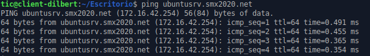
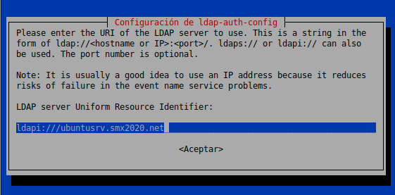
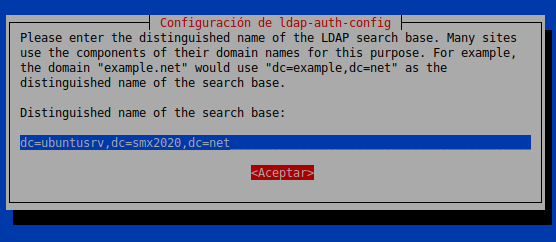
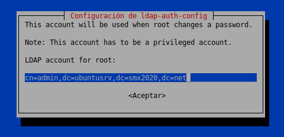

# Task: Join the Domain

In this task, we are going to join the domain the Ubuntu System to the Domain. 

   

En esta tarea vamos a unir al dominio una máquina Ubuntu, de tal manera
que los usuarios que creemos en el LDAP en el Servidor puedan iniciar
sesión en nuestra máquina cliente Ubuntu.

Requisitos:
-----------

-   Servidor LDAP instalado en la máquina Ubuntu.
-   Ambas máquinas actualizadas.
-   Ambas máquinas encendidas.
-   Conectividad entre ellas.
-   Resolución de nombres habilitada.

Una de las cosas que debéis comprobar es esto:



Si no va el `ping` con resolución de nombres...arreglarlo, no sigáis con
la práctica.

Ficheros y comandos útiles
==========================

A lo largo de la práctica necesitaremos ver si vamos por el buen camino
en multitud de lugares, para ver errores y demás recordad que el sistema
va apuntando en ficheros las diferentes acciones que se van realizando,
de tal manera que podamos ver qué está pasando.

Ficheros interesantes para comprobar fallos en esta práctica:

-   `/var/log/syslog`
-   `/var/log/sssd/sssd.log`
-   `/var/log/auth.log`

Comandos que nos pueden ayudar:

-   `tail -f /var/log/syslog`
-   `ping`
-   `getent passwd`


`\newpage`{=latex}

Instalación de LDAP - Cliente
-----------------------------

Instalamos los paquetes siguientes en la máquina que va a ser nuestro
cliente (escritorio):

  Paquetes
  -------------
  libnss-ldap
  libpam-ldap
  ldap-utils

En la configuración deberemos rellenar algunos parámetros:

  Parámetros:           Valor
  --------------------- -------------------------------------------
  ldapi                 `ldapi:\\ubuntusrv.smx2020.net`
  distinguished-name    `dc=ubuntusrv,dc=smx2020,dc=net`
  ldap-version          `3`
  Root Database Admin   `Yes`
  LDAP Database Login   `No`
  LDAP Account Root     `cn=admin,dc=ubuntusrv,dc=smx2020,dc=net`
  LDAP Pass             `Lin4dm1n`

Algunas imágenes son:







Disclaimer
==========

A partir de este punto, el tutorial contiene apartados de *obligado
cumplimiento* en la lengua del Imperio Británico. Good Luck!

`\newpage`{=latex}

LDAP & TLS
==========

Seguid los pasos de esta guia y conseguid que LDAP use TLS para crear el
canal de comunicación seguro:

[<https://ubuntu.com/server/docs/service-ldap-with-tls>](https://ubuntu.com/server/docs/service-ldap-with-tls)

Una vez lo tengáis...continuad con la práctica.


SSSD - Instalación
==================

**SSSD** es el Demonio de Servicios de Seguridad del Sistema (*System
Security Services Daemon*).

Nos permitirá configurar en el Sistema diferentes mecanismos de
seguridad que nos proporcionarán acceso a
Usuarios/Grupos/Contraseñas....

El primero que vamos a configurar es el LDAP que hemos configurado en la
práctica anterior.

La práctica asume que se puede *resolver por nombre* el servidor del
tipo:

`ubuntusrv.smx2020.net`

Y que tenemos *conectividad* con él.

Comenzaremos instalando en la máquina Cliente de GNU/LinuX los
siguientes paquetes:

`sssd libpam-sss libnss-sss`

SSSD - Configuración
====================

Una vez instalado el servicio de SSSD no provee ningún fichero por
defecto, así que lo crearemos donde nos indican:

-   `/etc/sssd/sssd.conf`

Se trata de un fichero `inifile` como los que vimos en Samba.

Habrá que configurar las siguientes secciones:

`\newpage`{=latex}

``` {.inifile}
[sssd]
services = nss, pam, ifp
config_file_version = 2
domains = smx2020.net

[nss]
filter_groups = root
filter_users = root
reconnection_retries = 3

[domain/smx2020.net]
ldap_id_use_start_tls = True
cache_credentials = True
ldap_search_base = dc=ubuntusrv, dc=smx2020,dc=net
id_provider = ldap
debug_level = 3
auth_provider = ldap
chpass_provider = ldap
access_provider = ldap
ldap_schema = rfc2307
ldap_uri = ldap://ubuntusrv.smx2020.net
ldap_default_bind_dn = cn=admin,dc=ubuntusrv,dc=smx2020,dc=net
ldap_id_use_start_tls = true
ldap_default_authtok = Lin4dm1n
ldap_tls_reqcert = demand
ldap_tls_cacert = /etc/ssl/certs/ldapcacert.crt
ldap_tls_cacertdir = /etc/ssl/certs
ldap_search_timeout = 50
ldap_network_timeout = 60
ldap_access_order = filter
ldap_access_filter = (objectClass=posixAccount)
ldap_user_search_base = cn=goblins,dc=ubuntusrv,dc=smx2020,dc=net
ldap_user_object_class = inetOrgPerson
ldap_user_gecos = cn
enumerate = True
debug_level = 0x3ff0
```

Customización
-------------

Debéis adaptar todos los valores necesarios para que se adapte a la
configuración que cada un@ tiene en sus máquinas virtuales.

Podéis encontrar más información en:

-   `man sssd.conf`
-   `man sssd-ldap`

OpenLDAP Server CA en el Cliente
================================

SSSD solo funciona si estamos utilizando un canal seguro de comunicación
(TLS).

Así que debemos tener en configurado nuestro LDAP Server ya lo tenemos
con (Guia anterior).

Los pasos que se describen ahora deben ser adaptados para que ajusten a
vuestro escenario.

Descarga el Certificado de la CA desde el servidor
--------------------------------------------------

Se puede utilizar este comando (es una única línea).

``` {.shell}
openssl s_client -connect ubuntusrv.smx2020.net:636 -showcerts < /dev/null 
        | openssl x509 -text | sed -ne '/-BEGIN CERTIFICATE-/,/-END CERTIFICATE-/p'
```

En caso de que tengáis el servidor escuchando `STARTTLS` en el puerto
389 (ya sea por tcp o por udp), utilizad el comando siguiente:

``` {.shell}
openssl s_client -connect ubuntusrv.smx2020.net:389 -starttls ldap -showcerts < /dev/null 
        | openssl x509 -text | sed -ne '/-BEGIN CERTIFICATE-/,/-END CERTIFICATE-/p'
```

Copiad la parte del certificado y guardadla en la ruta que habéis
indicado en el fichero que habéis indicado al sssd.conf.

Validad el certificado:

``` {.shell}
openssl s_client -connect ubuntusrv.smx2020.net:389 -CAfile /etc/ssl/certs/ldapcacert.crt
```

Debéis obtener un resultado similar a una de las siguientes líneas:

-   `Verification: OK`
-   `Verify return code: 0 (ok)`

Ahora en el fichero `/etc/ldap/ldap.conf` estableced el valor de
`TLS_CACERT` a la ruta del certificado de la CA que hemos creado antes.

Permisos en SSSD
================

Estableced permisos de `0600` solo al usuario `root` a todas las
carpetas y ficheros del directorio (y subdirectorios) de :

-   `/etc/sssd/`

Reiniciad el servicio sssd.

-   `systemctl restart sssd`

Aseguraos de que todo está funcionando:

-   `systemctl status sssd`

Si todo funciona, habilitadlo en el arranque:

-   `systemctl enable sssd`

pam-mkhomedir
=============

Ya casi estamos acabando (si está todo funcionando \^\_\^).

Ahora vamos a habilitar el módulo de PAM que autogenere el
`HOME Directory` de los usuarios al logarse (si no existe).

Editad el fichero:

`/etc/pam.d/common-session`

Y debajo de la línea:

``` {.shell}
session optional pam_sss.so
```

Escribid:

``` {.shell}
session required        pam_mkhomedir.so skel=/etc/skel/ umask=0022
```

Salvad y salid.

Comprobaciones
==============

Comprobad que el usuario goblin01 aparece si ejecutamos el comando:

`getent passwd goblin01`

Una vez aparezca, comprobad que podéis iniciar sesión con el usuario
tanto por el entorno gráfico como via `ssh` y `tty`.

Avisad al profesor cuando tengáis esto.

`\newpage`{=latex}

Tareas:
=======

Estas tareas son un ejemplo de lo que tendréis que resolver en el
exámen.

Tarea 01
--------

Cread 4 usuarios más (goblin02,goblin03,goblin04,goblin05).

Tarea 02
--------

Realizad un SCRIPT de inicio de Sesión que si el usuario pertenece a la
`cn=goblins` monte un directorio NFS desde el servidor. Para ello
tendréis que :

-   Configurar el servicio NFS en el servidor para que exporte:
    `/srv/tropas`. (Por Nombre y no por IP).
-   Crear el script en el cliente para que compruebe la pertenencia a
    ese `cn`.
-   Hacer que el script se ejecute cuando el usuario inicie sesión.

A los 5 usuarios `goblin0*` debe aparecerles en su carpeta personal una
carpeta compartida por NFS que esté en el servidor : (`/srv/tropas`). El
punto de montaje en el cliente ha de ser:

-   `$HOME/tropas/`

El Script debe (indicando en `syslog` si tiene éxito o no):

-   Comprobar que somos un usuario de LDAP.
-   Comprobar que estamos en el `cn=goblins`.
-   Comprobar que `$HOME/tropas` existe y es un directorio, si no existe
    crearlo.
-   Montar la carpeta exportada desde el servidor.

Tarea 03 (Opcional)
-------------------

Haz que el servidor sea cliente de LDAP para la validación de usuarios a
nivel local y establece permisos \"extendidos\" sobre las carpetas
exportadas (`/srv/tropas/`) donde se pueda comprobar que efectivamente
el usuario `local` y el `remoto` son el mismo objeto de seguridad y se
les pueden aplicar las mismas reglas.


