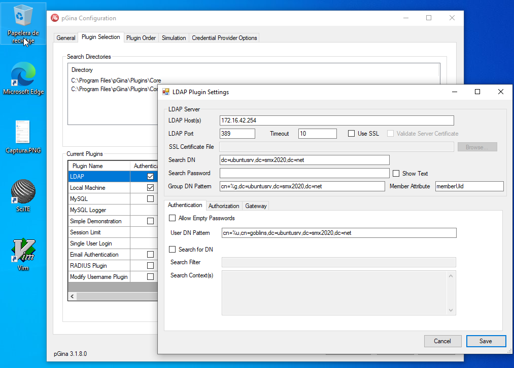
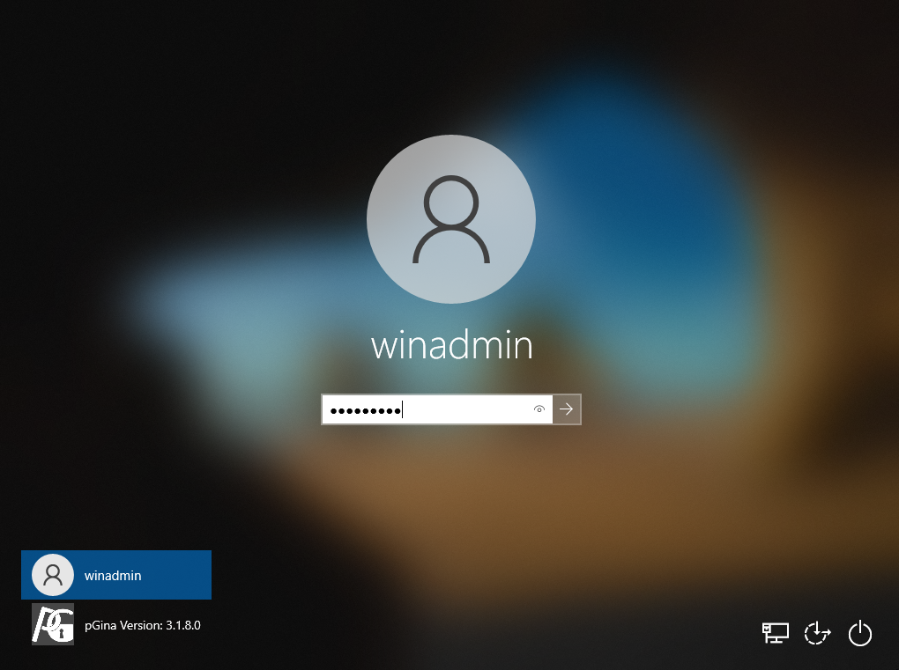
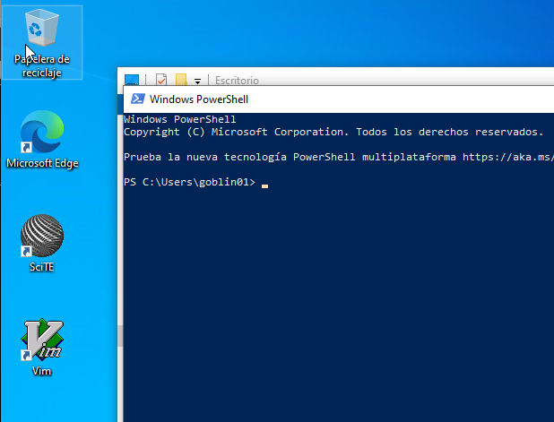

# Task: Join the Domain

In this task, we are going to join the domain the Windows System to the Domain. 

In this configuration, the users that we will create at our OpenLDAP Server, will be able to login as a *local* users 
in the machines that we would configure as OpenLDAP Clients.  

## Requeriments:

- OpenLDAP Server Installed and configured on the Ubuntu Server Machine (**ubuntusrv.smx2021.net**)
- Systems Updated 
- DNS Resolution between machines (using *bind9*).

## Some files and logs

In our sysadmin works exists a lot of *commonplaces*, files and situations that 
if not are exactly the same, seems a *deja-vu*. 

We can use several files in order to test if the services are up and running.

Some examples:

- `/var/log/syslog`

Useful Commands:

- `tail -f /var/log/syslog`
- `ping`
- `getent passwd`
- `systemctl [restart|start|stop] service`

\newpage

## LDAP Client Installation Software

At the Official Web of pGina : [pGina Webpage](http://pgina.org/) you can download the correct version and install it in your Windows Client Machine.

When the installation will be finished, please *reboot* your Virtual Machine.

\newpage

## pGina Configuration

Configure pGina to adapt to you requeriments (as you can see at the picture). 

On the *tab* **Simulation**, you must test if the configuration is working fine.

When the light goes green, logout and try to make login withe the users goblins from LDAP.

Make an screenshot with the result.

# Task 01: Users centralized!

Now add a user in ldap at the same level that goblins with your firstname, and make login from the Windows System.

Write a document with all the user creation process explained (and successful login, of course).
 

# Task 02: Additional Features

Install the software [Chocolatey](https://chocolatey.org/), and make simple PowerShell script that 
asks the user if he/she want to install the next packages:

- Opera GX
- Notepad++

