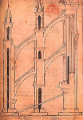
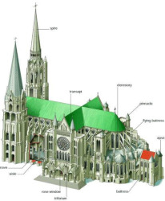
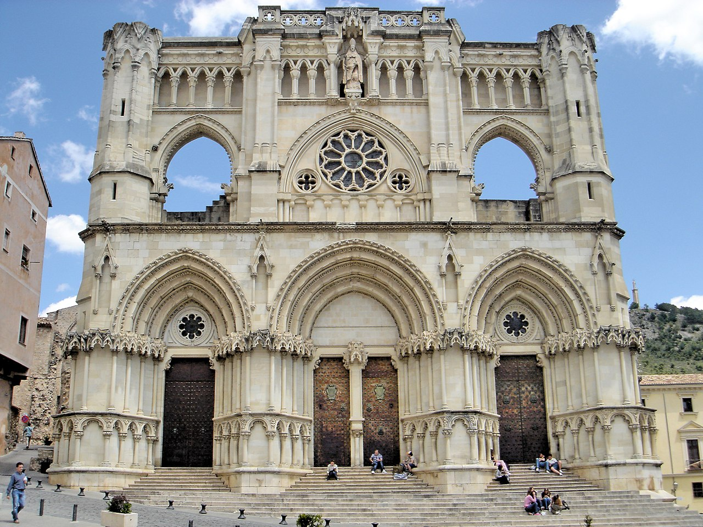

# Tasks: Remembering PowerShell


## Task 01 : Randomizer

Code a PowerShell script that using arguments, generate several random numbers (simulating a *dice tower*) and show the results to the user.

The behaviour is the next:

- The first argument set the number of dice faces that has the dice.
- The second argument set the number of dices of this number of faces given.
- The third argument set the minimun  result in the dice throwing that results in a success. 

For each dice, if the number is greater or equal to the number given as success, the output must concatenate a "\*".

At the end of the dice output, show the number of success given.

The output must show all the results.

Example:

```PowerShell

C:\Users\winadmin\Escritorio\randomizer.ps1 6 3 4
- Dice 1: 3
- Dice 2: 2
- Dice 3: 5 *
-------
Success: 1

```

The script must check that the arguments are numbers and are only 2 arguments.

\newpage
## Task 02 : PowerShell + Architects of the West Kingdom

One of the characteristic aspects of the Gothic architecture for large *Religious Buildings* is **The Light**. In previous epochs, tools and technics were unable to provide mechanism in ordert to permit big windows. Then, in Gothic appears *the flying buttresses*, an artifact-construction that allowed the great architectthe opening of large stained glass windows that would bring the light to the parishioners and clergy.

\

This kind of construction was usually placed every 5 metres along the façade, providing plenty of light inside the building.

\

\newpage
Make a script that using two arguments:

- The first one must be the number of parishioners who come to visit the monument.
- The second, optional [`--covid` ] , is whether or not to take into account covid measures. By default, covid measures are disabled.

Behaviour and aspects to take into account:

- Each parishioner requires 1.2 square meters of living space.
- If covid measures are applied, the living space of each parishioner is 2 square meters.
- Consider that the front of the monument is 30 meters long.

The script has to display the following on the screen:

- The number of square meters required to accommodate all parishioners.
- The number of flying buttresses needed to build the monument.

Example:

```PowerShell
C:\WestKingdom\Buttress.ps1 300 --covid
 - Runnig ....
 - Square Meters: 600
 - The size of the plant required is : 30 x 20 meters.
 - Flying Buttresses needed: 4 x 2 = 8. 
```

Other Example:
```PowerShell
C:\WestKingdom\Buttress.ps1 300
 - Runnig ....
 - Square Meters: 360
 - The size of the plant required is : 30 x 12 meters.
 - Flying Buttresses needed: 3 x 2 = 6. 

```

\\


