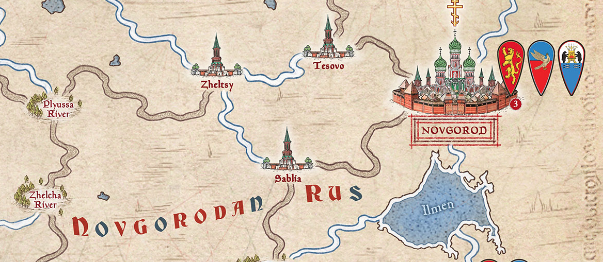

# A Ortodox Exam

Today is the NEW YEAR for the Ortodox Calendar (2022).

## Task 1 : Alexander Nevsky ( 4 Points)

Alexander Nevsky was one of most famous Princes of Novgorod, he defeat uncountables enemies over the inmense Rus Land.

Commonly regarded as a key figure of medieval Rus, Alexander was a grandson of *Vsevolod the Big Nest* and rose to legendary status on account of his military victories over German and Swedish invaders. He preserved Russian statehood and Russian Orthodoxy, agreeing to pay tribute to the powerful *Golden Horde*. **Metropolite Macarius** canonized Alexander Nevsky as a saint of the **Russian Orthodox Church** in 1547.

\

One of first crusades was in this infamous land, where logistic and the land were the real enemies (as always in Russian).

We must develop a PowerShell script that helps the armies of Nevsky to manage the supply.

The items that you need to manage are:

- Food.
- Gold.
- Soldiers.

You must declare three variables (as a minimun) at the beginning of the script with the next values:

```PowerShell

$Food = 1000
$Gold = 100
$Soldiers = 10

```

The script must offer a simple menu with the next possible actions:

```PowerShell
1) Crossing a River.
2) Rest.
3) Scavenge.
4) Assault a fortress.
5) Pillage a town.
6) Quit

```

After each action (including quit), the script must display the resources that remains for our Army.

The behaviour of each action is described below:

## Crossing a river

Crossing a river spends 1 piece of gold for each Soldier in our army.

## Rest

Resting spends 2 from food for each soldier in our army + 10.

## Scavenge

Scavenging in the forests allows our army to replenish the food with 50 units.

## Assault a fortress

Assault is always a dangerous action, throw a dice of ten faces, if the result is 7 or less, your army is halved, if the result is 8, 9 or 10, you only lost the 25% of your army (the fractions must be rounded by up).

## Pillage a town.

Pillage a town adds 100 to our gold treasure but the 10% of our soldiers will be lost (the fractions must be rounded by up).


\newpage

# Task 2 : Statistics ( 2 Points)

To the task of the dice tower (from previous scripts), add the next features:

\

## Statistics

If the last argument (optional) is `--statistics` you must display for each number of the dice, what percentage from the total numbers generates matches this number.

Example:

```
Dice 1: 3 
Dice 2: 4
Dice 3: 1
Dice 4: 6
Dice 5: 6
Dice 6: 5
-----
Statistics:
1 - 17%
2 - 0%
3 - 17%
4 - 17%
5 - 17%
6 - 34%
```
## Dice Tower Effect

If the last argument (optional) is `--dice-tower` you must group the results. 

Other example:

```
Dice 1: 1 
Dice 2: 2
Dice 5: 2
Dice 3: 4
Dice 4: 4
Dice 6: 5
```
\newpage

# Task 3 : Users and LDAP

Create a new user named "Nevsky" with the next CN: `cn=nevsky,cn=rus,dc=smx2021,dc=net` and configure the PGina to allow the login in our Windows Enviroment.

\

The password must be: **Al3x4nd3r**. 

Additionally, create a PowerShell Script that test what is the status of the `ExecutionPolicy` in our Windows 10 System.

Add Screenshots and a Howto from all the process, including the script execution with the user Nevsky.

