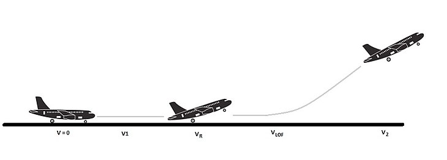
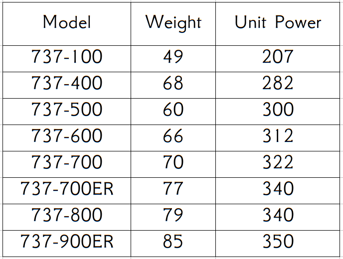

# A High-Flying problem!


Hi little pilots!

All the plains require a minimum speed (usually in knots), for make the *takeoff*. This speeds (also called **VR** in Spanish (for *Velocidad de Rotación*)), is the speed that allows the plane to beginning to takeoff from the runway. 

It is not exactly the same (Obviously) in all the planes, but for the most famous commercial models, it rounds the **300km/h**.

\


We need a Shell Script that helps the Architects to design and build a new airport that supports the most common models.


The script must calculate the *minimum* length of a runway that allows the models *takeoff*.


We have the next table that shows the stats of the most famous models of **Boeing 737**

\

Table description:

* First we have the model name.
* On the second column (weight) we have the weight in tones of the models.
* On the third column (Unit Power) we have the Power in *kilo-Newtons* of each motor (all the planes have 2).

Using the next formula, we can obtain the speed acquired when the plane has cover the runway.

**IMPORTANT**: The runway units are in the International Airport Unit for it : the *Hectometer*. In the formula, a 2 in this value is equivalent to 200 meters.

$$ ((UnitPower*NumberOfMotors*Hectometers)/Weight)*1,4 = Speed $$

\newpage
For example:

If we are calculating the speed for the first model:  the *737-100*:

And we use a runway of : 25 units (Hectometers) = 2,5 km, we get the next values:

$$ ((207*2*25)/49)*1,4= 295,714285714286 $$

It is not enough (for a little), we need 300 km/h (as a minimum).

We must use a bigger runway:

$$ ((207*2*26)/49)*1,4= 307,542857142857 $$

This result is *OK* we need a 26 Hectometers of runway to acquire the required Speed.

\newpage
## Mandatory Task:

Code a Shell Script that accepts via parameters the Unit-Power and the Weight and Display as a result the minimum size (in Meters) of the runway that is necessary to make the takeoff.

Example:

```shell
user@machine:~$./takeoff-runway-calculator.sh 49 207
---- 
---- The runway must have 2600 meters
```


## Optional Task:

Read from a file the data in a CVS format as is displayed at the picture (the table above) and show the results, indicating the model name and the length of the runway.


```shell
user@machine:~$cat planes.csv | ./takeoff-runway-calculator.sh
Model: 737-100 -> 2600 meters
Model: 737-400 -> 2600 meters
Model: 737-500 -> 2200 meters
Model: 737-600 -> 2300 meters
Model: 737-700 -> 2400 meters
Model: 737-700ER -> 2500 meters
Model: 737-800 -> 2500 meters
Model: 737-900ER -> 2700 meters

```


