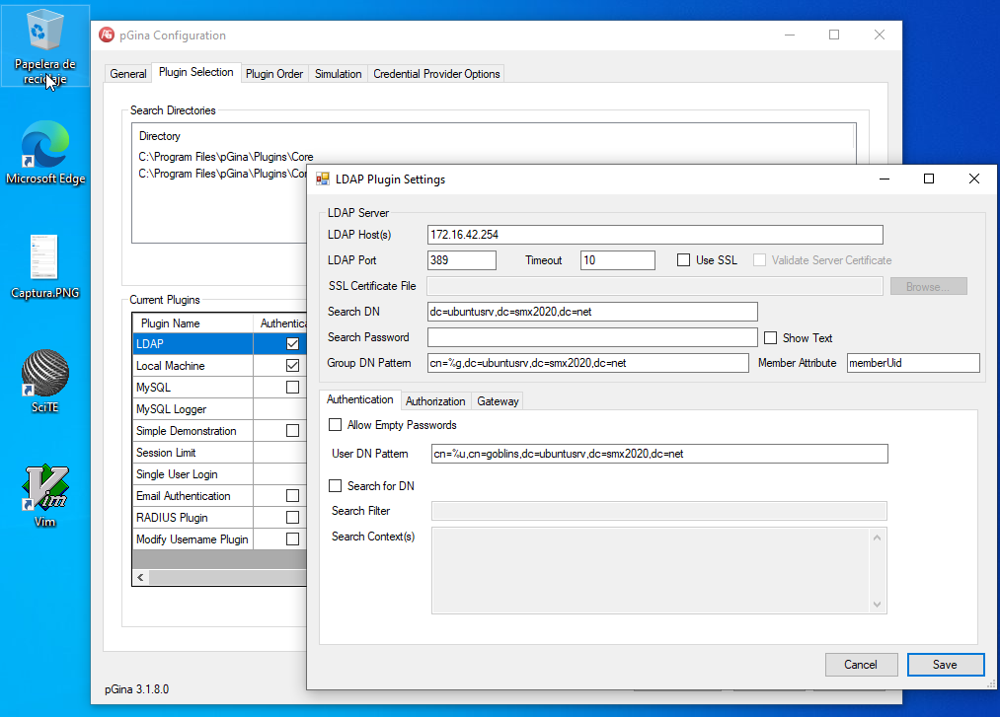
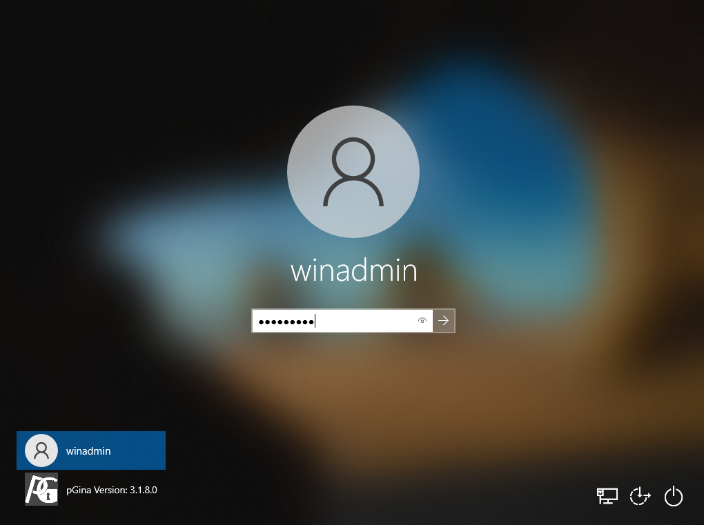

Tarea: Unión al dominio - Windows Cliente
=========================================

En esta tarea vamos a conseguir autenticarnos en la máquina Windows
utilizando los usuarios que hemos creado en nuestro servidor LDAP
(`goblin01`, `goblin02`,...).

Requisitos
----------

-   **Conectividad**: Necesitaremos que se resuelva por nombre el
    dominio de nuestro

servidor.

`ping ubuntusrv.smx2020.net`

-   **OpenLDAP server** instalado y acceso al `phpLDAPadmin` desde el
    cliente Windows (por comodidad).
-   **Usuarios Goblins** creados.

Instalación de pGina
--------------------

Acceder a la Web oficial de pGina : [pGina Webpage](http://pgina.org/) y
descargaros la versión adecuada. Instalarla en vuestro cliente Windows
10.

Una vez esté instalada, reiniciar Windows.

Configuración de pGina
----------------------

Configurar pGina tal y como se ve en la imágen (adaptándolo a vuestras
necesidades).

Debéis comprobar en la pestaña de `Simulation` que habéis realizado la
configuración de la manera adecuada.

Una vez lo tengáis verde (operativo), salir de la sesión e iniciad
sesión con los usuarios `goblins`...

Se puede comprobar que todo ha ido bien abriendo una terminal con el
Usuario `goblin01`,etc.

Avisad al profesor cuando estéis aquí.

Configuraciones adicionales
---------------------------

Investigad acerca del software [Chocolatey](https://chocolatey.org/) e
instaladlo en el Windows Cliente (*Individual*) y probad a instalar
**desde la línea de comandos** y usando chocolatey:

-   Opera GX
-   Notepad++ 7.9.2

Comprobad que lo podéis hacer para todos los usuarios.

Avisad al profesor cuando lo tengáis.
