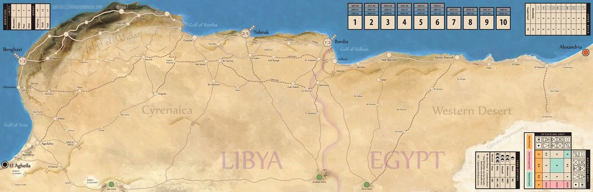

# Introducción

Algo de diversión variada

\newpage

# Tarea 01 : Procesos en ejecución (2 puntos)

Del listado de procesos en ejecución ( `ps -ef` ), necesitamos generar un script que nos pregunte 2 números:

- DESDE
- HASTA

Y debe mostrar los procesos del sistema *desde* el proceso cuyo número ha sido indicado  y *hasta* el número indicado por el usuario.

## Ejemplo de ejecución:

Si contamos con un listado de procesos como este:

```shell
UID          PID    PPID  C STIME TTY          TIME CMD
root           1       0  0 05:25 ?        00:00:01 /sbin/init splash
root           2       0  0 05:25 ?        00:00:00 [kthreadd]
root           3       2  0 05:25 ?        00:00:00 [rcu_gp]
root           4       2  0 05:25 ?        00:00:00 [rcu_par_gp]
root           6       2  0 05:25 ?        00:00:00 [kworker/0:0H-kblockd]
root           9       2  0 05:25 ?        00:00:00 [mm_percpu_wq]
root          10       2  0 05:25 ?        00:00:00 [ksoftirqd/0]
```
Y ejecutamos el script:

```shell
usuario@maquina:~$./script-recuperacion-02.sh
 * Dime desde que proceso: 3
 * Dime hasta que proceso: 5
---SALIDA---
root           3       2  0 05:25 ?        00:00:00 [rcu_gp]
root           4       2  0 05:25 ?        00:00:00 [rcu_par_gp]
root           6       2  0 05:25 ?        00:00:00 [kworker/0:0H-kblockd]
```
\newpage
# Tarea 02 : Tanques, tanques, tanques (6 puntos)

Uno de los problemas a los que se enfrentan los comandantes de tanques durante las guerras, es el abastecimiento de las líneas de suministro de los tanques.

A medida que durante un conflicto las unidades blindadas avanzan en territorio enemigo, las líneas de suministro que son los convoys que transportan combustibles, víveres, etc, deben avanzar junto con los tanques.

\

Los kilómetros que tienen que recorrer los convoys de abastecimiento son muchos, y se deben apostar (*dejar vigilando*) tanques vigilando dichas líneas de suministro.

Esos tanques que deben quedarse vigilando son parte de los batallones, así que cada vez que recorren kilómetros y van dejando vigilancia, los batallones son menos numerosos.

Realiza un Shell Script que ayude a los Comandantes a averiguar cuantos tanques quedarán al final de las línea de suministro al ir apostando los tanques cada *X* kilómetros.

- El Script debe preguntar *cuantos tanques debe dejar en cada puesto* con un mínimo de 2 y un máximo de 7 tanques.
- A continuación debe preguntar *cada cuantos kilómetros* se establecerán los puestos de vigilancia.

El número de tanques en el batallón inicial es de *540* tanques.

Teniendo en cuenta que debemos recorrer *3300* kilómetros hasta *Tobruk*, el Script deberá tener en cuenta esos datos y tras el cálculo de los tanques que se quedan atrás, indicar **cuantos** tanques quedarían disponibles para el asalto final. En caso de que no hayan suficientes tanques, mostrar un mensaje indicando el número de kilómetros de las líneas de suministros que quedarían vigilados.

Tanto el número de tanques iniciales como los kilómetros a recorrer hasta Tobruk, deben ser variables establecidas *dentro* de script, no hace falta que lo preguntéis al usuario.

Ejemplos de ejecución:

```shell
usuario@maquina:~$./script-recuperacion-03.sh
 * Calculadora de Tanques
 * KM a recorrer: 3300
 * Tanques iniciales: 540
 * Cada cuantos kilometros vigilamos : 110
 * Cuantos tanques dejamos vigilando : 6
 --- CALCULOS ---
 -- ASALTAMOS Tobruk --
 -- Quedarian : 360 tanques para asaltar Tobruk.

```

```shell
usuario@maquina:~$./script-recuperacion-03.sh
 * Calculadora de Tanques
 * KM a recorrer: 3300
 * Tanques iniciales: 540
 * Cada cuantos kilometros vigilamos : 20
 * Cuantos tanques dejamos vigilando : 6
 --- CALCULOS ---
 -- No llegamos a Tobruk.
 -- Quedarian 1800 Kilometros de lineas de suministro cubiertas.

```

\newpage

# Tarea 03 - Script Red (2 puntos)

Realizad un script que muestre primero cuantas tarjetas de red tiene un sistema (Incluida loopback), así cómo su nombre de dispositivo.

A continuación pedirá al usuario que indique de qué tarjeta quiere obtener información y este se lo indicará introduciéndo el nombre (`lo`, `eno`, `enp0s5`, ...) de la tarjeta.

La información que se debe mostrar de la tarjeta de red indicada es:

* La IP.
* La Máscara en formato CIDR (/24, /8/,...).
* Cuantos Hosts hay como máximo en esa red junto con esa máquina.(Esto debe calcularse).

Ejemplo de ejecución:

```shell
usuario@maquina:~$./script-recuperacion-04.sh
* Las tarjetas de red conectadas son:
1: lo:
2: enp5s0:
3: enx000ec6d3e152:

 * Dime una tarjeta : enp5s0
 * La IP es : 192.168.1.51
 * La Mascara es : 24
 * La red permite hasta 254 hosts
```