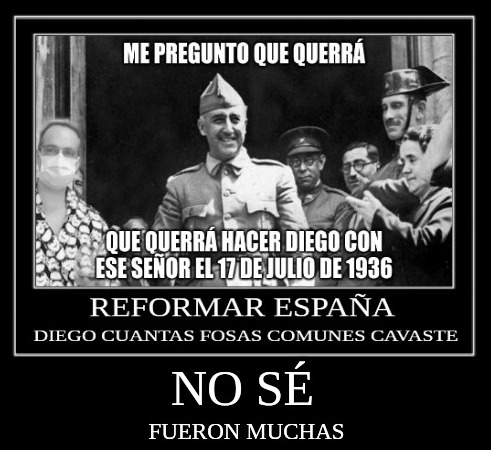
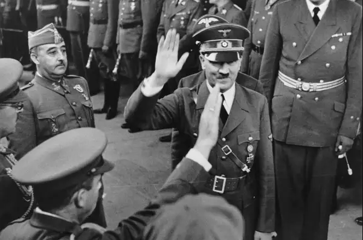
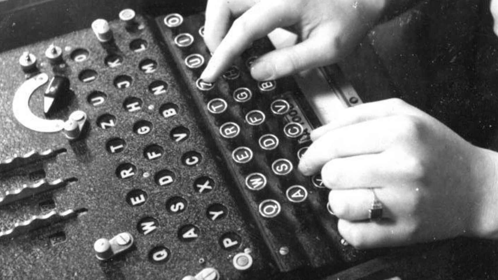
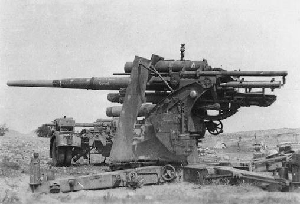

# Introducción


Se pide una lectura atenta y detallada de las tareas que se deben realizar, con el objetivo de contemplar la tarea en su totalidad y asimilar cuáles serán los pasos que tendremos que ir implementando para conseguir el éxito que supone relacionar y poner en práctica todo lo aprendido en la realización de esta tarea.

Vamos a valorar cada apartado de la realización de este pequeño simulacro de manera conjunta y será tenido en cuenta en todos los módulos implicados:

- Aplicaciones Web.
- Seguridad Informática.
- Servicios en Red.
- Sistemas Operativos Multiusuario y en Red.

Cada una de las partes de la práctica plantean una serie de ficheros/capturas/scripts, que deberán entregarse en Aules en una única entrega en el módulo de SOX. 

Mucha suerte a tod@s.

\newpage

# Introducción Histórica

En Febrero del año 2022 una peligrosa organización: los **CronoTerroristas**, vigilada por la fundación SCP encontró la manera de aprovechar las brechas temporales creadas por los rayos *delta* provenientes del Sol y decidió alterar el curso de la historia a su beneficio. Envió a diferentes agentes a alterar el curso de la historia, para conseguir la dominación mundial.

Sin embargo, los profesores del grado medio de informática del IES La Senia,  que estaban teniendo una reunión de evaluación en las proximidades, se dieron cuenta de sus intenciones y sin tener en cuenta su propia seguridad, se lanzaron a detener a los malvados *CronoTerroristas*, en una serie de actos que sin duda merecerán algún tipo de reconocimiento. 

Además, los profesores no están solos, ya que cuentan con el mejor equipo de alumnos que jamás ha pisado la tierra: los legendarios SMXDOS. 

¿Serán capaces los profesores de informática junto con los alumnos de detener a los villanos? 

Estudiando los rayos *delta* del dia 17 de Febrero, el equipo de investigación se ha dado cuenta de que a intervalos de 50 minutos, la clase de Informática 5 del IES La Senia, va a tener un agujero de *lombriz* a las diferentes épocas en las que se encuentran los *CATASTROPROFES*. 

\

Debéis ayudar a los *catastroprofes* a detener a los diferentes personajes históricos que los secuestraron e impedir que cambien el curso dela história.

\newpage

# España y la 2a Guerra Mundial

Tenemos 50 minutos para ayudar a Diego a detener los planes de Suministro al Tercer Reich. 

\

Francisco Franco ayudó durante la Segunda Guerra mundial vendiendo materiales y armas a los alemanes, puesto que tras la Guerra Civil Española el país no disponía de soldados para enviar a luchar con los alemanes. La participación de algunas unidades españolas, como la División Azul no dejó de ser anecdótica dentro del gran teatro europeo de la guerra.



Vuestra misión radica en boicotear desde varios frentes:

- Identificar las localizaciones de envío de las armas.
- Espionaje de los cálculos de las armas.

\newpage
## Frente 01: Identificación



Se han interceptado tres mensajes con las localizaciones de los envíos de armas que se van a producir. En todos ellos se comienza con la fecha y hora de envío en formato timestamp, seguido de un texto con la ciudad alemana a la que se va a enviar el paquete de armas.

```shell
1944-02-03 08:31:41.0773701 GHVWLQR XQR: FRORQLD
1944-02-03 09:22:23.0156381 IJXYNST ITX: MFRGZWLT
1944-02-03 11:31:11.0079281 KLZAPUV AYLZ: ZABAANHYA
```

Debéis desencriptar el mensaje, teniendo en cuenta que dependiendo del segundo en el que fueron generados, se utiliza un método u otro:

- Durante los segundos 00-20, la letra del alfabeto se desplaza 3 posiciones.
- Durante los segundos 21-40, la letra del alfabeto se desplaza 5 posiciones.
- Durante los segundos 41-59, la letra del alfabeto se desplaza 7 posiciones.

Ignorar los carácteres que no pertenezcan al alfabeto siguiente:
A 	B 	C 	D 	E 	F 	G 	H 	I 	J 	K 	L 	M 	N 	O 	P 	Q 	R 	S 	T 	U 	V 	W 	X 	Y 	Z


```
SOLUCION:
1944-02-03 08:31:41.0773701 Destino uno: Colonia
1944-02-03 09:22:23.0156381 Destino dos: Hamburgo
1944-02-03 11:31:11.0079281 Destino tres: Stuttgart
```

\newpage
## Frente 02: Espiar



Habéis conseguido el acceso al ordenador central de un alto mando alemán. Debéis sustraer los datos de las armas de que se van a enviar, y realizar una copia en un servidor seguro. Tenéis que usar una conexión segura mediante `SCP`, para enviar los siguientes ficheros, previamente comprimidos con la contraseña `ENIGMA`.

```shell
/tmp/artilleria/Flak_88.txt
/tmp/artilleria/Granatwerfer_80mm.txt
/tmp/artilleria/Feldhaubitze_18.txt
```

El fichero debe tener el siguiente formato `esp_mort_FECHA.tar.gz`, donde `FECHA` debe contener la fecha actual en formato "AAAAMMDD".

Debéis configurar vuestro Xubuntu cliente para que ejecute el script y copie mediante scp al Ubuntu Server sin que pida contraseña. (Claves SSH).

## Entrega

Subir los Shell Scripts a Aules, nuestro profesor Diego, será capaz de usarlos para detener los planes de los malvados *CronoTerroristas*. 
