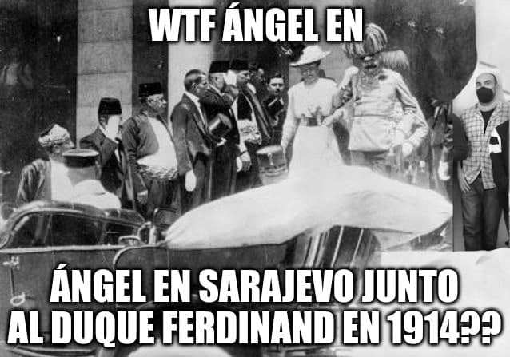
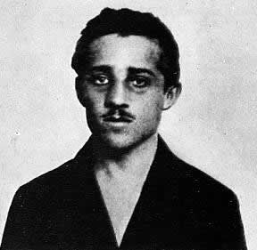
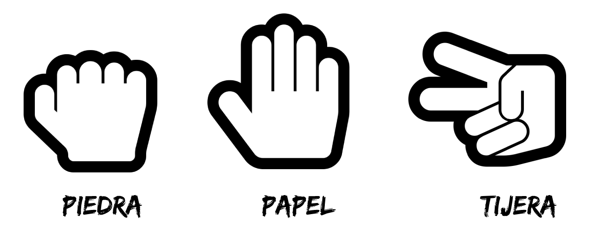

# La Gran Guerra

Son las 8:50 y se nos acaba de abrir una ventana de 50 minutos...

Estamos en Sarajevo, año 1914, es una cálida mañana de Junio, y el Archiduque Francisco Fernando se dirige al palacio presidencial...sin embargo...hay alguien que lo espera en un bar, armado hasta los dientes y dispuesto a todo para defender la causa Serbia... ¿Quién le ha dado el arma  a Gavrilo Princip?...Un misterioso sujeto, también llamado SCP-127001 parece rondar por los alrededores del palacio.

Angel está allí para intentar detener el magnicidio e impedir que los Imperios se ataquen entre ellos.



## Scripting

La escalada de tensiones entre los diferentes paises de Europa y Asia dará lugar a la Primera Guerra Mundial (o La Gran Guerra) si el Archiduque es asesinado. ¿Podemos detener a los Ultranacionalistas?. Pues sí, resulta que podemos intentar averiguar cuál es el armamento que lleva Gavrilo Princip y utilizar contramedidas.


\

Cómo todo el mundo sabe, existe una correlación entre el famoso juego *Piedra, papel, tijera* y las tres armas que llevaban los *partisanos* Serbios:

- Martillo (Piedra).
- Espada (Papel).
- Puñales (Tijeras).

Necesitamos entrenarnos para enfrentarnos a *Gavrilo Princip*, así que les pedimos a los miembros de *SMXDOS* que programen un ShellScript en GNU/LinuX que juegue al famoso juego de *Piedra, papel, tijera*, pero adaptándolo a las consideraciones de los Serbios (sustituyendo la piedra por el martillo, el papel por la espada y las tijeras por los puñales).

\


El Script ha de jugar por *Gavrilo* de manera aleatoria (simulando que elige a ciegas) y permitiendo al usuario elegir entre las armas.

Las reglas son las mismas que las del juego clásico y se juegan las partidas al mejor de 3 intentos  (es decir, que si alguno de los jugadores llega a 2 puntos, se acaba la partida).

\newpage 

Ejemplo:
```shell
 * Simulador Serbio de Armamento
 -------
 Ronda 1
 Gavrilo 0 / Angel 0
 Elige arma:
 1) Martillo
 2) Espada
 3) Punyales
 q) Salir
 Arma elegida : 1
 Gavrilo (Martillo) / Angel (Martillo)
 Empate
 -------
 Ronda 2
 Gavrilo 0 / Angel 0
 Elige arma:
 1) Martillo
 2) Espada
 3) Punyales
 q) Salir
 Arma elegida : 1
 Gavrilo (Espada) / Angel (Martillo)
 Gana Gavrilo
 -------
 Ronda 3
 Gavrilo 1 / Angel 0
 Elige arma:
 1) Martillo
 2) Espada
 3) Punyales
 q) Salir
 Arma elegida : 2
 Gavrilo (Martillo) / Angel (Espada)
 Gana Angel
 -------
 Ronda 4
 Gavrilo 1 / Angel 1
 Elige arma:
 1) Martillo
 2) Espada
 3) Punyales
 q) Salir
 Arma elegida : 3
 Gavrilo (Espada) / Angel (Punyales)
 Gana Angel
 Hemos ganado la Guerra!
```


Los empates no se tienen en cuenta y se vuelve a realizar la jugada.

¡Ayuda a Ángel a detener a Gavrilo! Envíale el Script por Aules. Salva a la humanidad.

