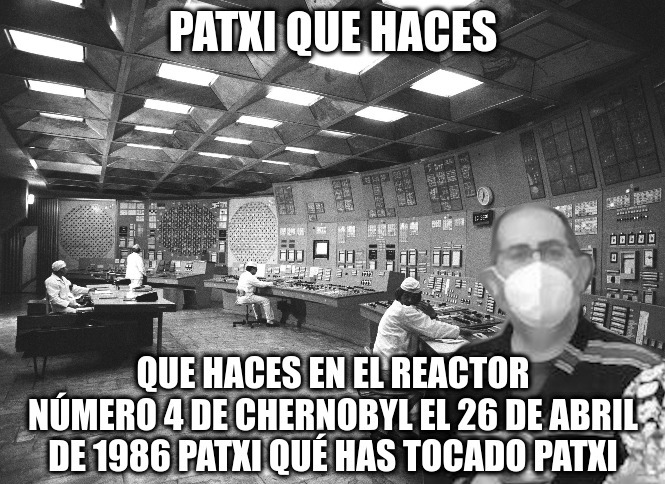

# FTP y Chernobyl

Nuestro compañero Patxi ha acabado en un lugar de la URSS...

\

Son las 9:50 y se nos acaba de abrir una ventana de 50 minutos...

Acabáis de recibir este mensaje :

```
From: SeXSymb0l@smx2021.net
To: s-team@smx2021.net
Subject: Necesito vuestra ayuda

Hemos recibido la siguiente información de nuestra sexción de espias:

En el reactor n2 de la Central Nuclear de Chernobyl acaba de saltar un sensor de calentamiento del núcleo n27. Todo el personal está convencido de que se trata de un fallo en la lectura del sensor, ya que esto es imposible, debido a que esta situación no está contemplada en el manual técnico de la URSS. En circunstancias normales el super ordenador principal, llamado StalinOS, controla todas las incidencias y las *soluciona*. Pero vosotros sabéis qué puede llegar a pasar.

Debemos desactivar a StalinOS, para poder apagar el reactor. El problema es que el ordenador tiene mecanismos para no permitirlo. Hay que franquear las medidas de seguridad previstas por la URSS.

Os necesito.

```

Lo primero es acceder al servidor de StalinOS, y para ello debéis conseguir el **código**.

Para poder entrar al servidor, debéis hacer un FTP a esta dirección:

```
192.168.5.247
```

el usuario será `sexyXX` donde `XX` será vuestra posición dentro del aula:

* sexy01
* sexy02
* ...
* sexy19

Y la contraseña, la misma.

Con lo *encontrado*, deberéis acceder al `ftp` de :

```
stalin@192.168.4.247
```

Seguid las instrucciones que encontréis en el `ftp`.

