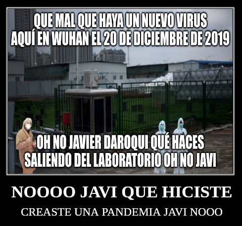

# FTP y Chernobyl

Nuestro compañero Daroqui se encuentra en Wuhan...

\

Nos envia este mensaje:

Se han detectado algunas vulnerabilidades el CPD del laboratorio de Wuhan. Debes modificar el firewall para evitar posibles catástrofes.
Las características del CPD son las siguientes:

LAN con dirección de red 192.168.1.0/24:

  - Equipo del *sysadmin* con dirección 192.168.1.15.
  - Equipo del *jefe* del departamento de nuevas cepas con dirección 192.168.1.150.
  - Servidor PostgreSQL con una base de datos de virus con dirección 192.168.1.30

DMZ con dirección de red 192.168.50.0/24

  - Servidor web con dirección 192.168.50.10 sirviendo HTTP y HTTPS.

Firewall con 3 tarjetas de red con la siguiente configuración:

  - `enp0s3` conectada a la LAN. 
  - `enp0s8` conectada a la DMZ.
  - `enp0s9` conectada a Internet (el firewall es a su vez un router).

EL *sysadmin* tiene una IP fija en su casa 84.123.65.30.

Para evitar la catástrofe debes configurar el firewall de la siguiente forma:

  - Tanto los equipos de la LAN como de la DMZ deben poder navegar por Internet (páginas web) sin restricciones.
  - Tanto los equipos de la LAN como de la DMZ deben poder consultar servidores de tiempo NTP externo.
  - Los equipos de la LAN deben poder hacer ping a cualquier dirección de Internet.
  - El jefe del departamento de nuevas cepas tiene un pc con la dirección 192.168.1.150. Ha solicitado acceso al puerto 8900 de cualquier dirección externa ya que es un puerto donde escucha una aplicación especial de diferentes laboratorios. 
  - El sysadmin debe poder acceder al cualquier puerto de Internet.
  - No se debe permitir NADA más desde la LAN hacia el exterior.
  - El sysadmin debe poder acceder por ssh desde la LAN al servidor web.
  - El servidor web debe poder consultar la base de datos de virus.
  - No se debe permitir NADA más desde la DMZ a la LAN.
  - Los accesos a los puertos web del firewall deben redirigirse al servidor web de la DMZ.
  - Para que el sysadmin pueda acceder desde su casa al sistema del servidor web, lo hará a través del puero 8822 y el firewall lo redirigirá al puerto ssh genérico del servidor.
  - Se debe bloquear cualquier otro acceso desde Internet a la DMZ.

Enviad el script de Iptables correspondiente mediante Aules a Javi! 
