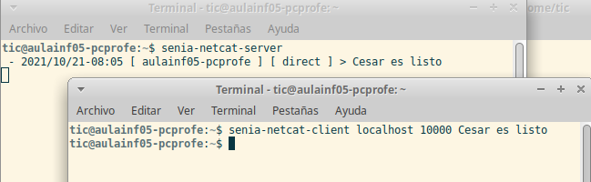

# Introducción

En esta tarea vamos a realizar una serie de Scripts y ejecuciones que servirán para comprobar
si tenemos claros los conceptos relativos al uso de NetCat y el uso de los túneles y los puertos.

# Requisitos

Para la realización de esta práctica utilizaremos :

- La máquina local (hipervisor).
- La máquina Xubuntu (guest).
- La máquina Ubuntu Server (guest).

En todas ellas deberá estar instalado tanto el `netcat` cómo el `ssh`. 

## senia-netcat-server

Para la realización de esta práctica tendréis que instalar y configurar para adaptarlo a vuestras necesidades 
un pequeño servidor que usando `netcat` es capaz de aceptar peticiones a través de un puerto (tendréis que averiguar cuál).

Este servidor ha sido realizado por unos magos y deberéis de instalarlo a través de los repositorios.

PPA de los Magos (a.k.a Repositorio):

```shell
https://launchpad.net/~ticsenia/+archive/ubuntu/ppa
```

El paquete se llama : `senia-netcat-server`. Debéis instalarlo y configurarlo. (Buscad el fichero de configuración y modificadlo).
Para ello podéis usar todo lo aprendido durante los dias pasados en clase.

Debéis instalar el paquete tanto en el Xubuntu como en el Ubuntu Server.

### Entrega 

En la entrega adjuntad una captura de la salida del comando siguiente ejecutado en el Xubuntu y el Ubuntu Server:

```shell
dpkg -l | grep senia-netcat
```

# 

Una vez tengamos ese pequeño paquete instalado, vamos a configurarlo para que se adapte a cada uno. 

Tiene tres posibles valores a configurar:

```shell
# Puerto
SNPORT

# Ip
SNIP

# Fichero de log
SNFILE
```

Debéis encontrar en qué fichero se configuran esos valores y cambiarlos para se adapten a la siguiente situación:

## SNPORT

* Averiguad el nombre de vuestro equipo (para los que vengáis con portátil, pues calculadlo en función de vuestra posición en el aula)
* SNPORT : Empezando desde el puerto 101XX, cambiad los dos últimos para que se adapte a vuestro equipo, ejemplos:
  * ISAAC (aulainf05-pc02): 10102
  * RONAL (aulainf05-pc14): 10114

## SNIP

SNIP: Dependerá de si estais configurandolo en el Ubuntu Server o en Xubuntu.

## SNFILE

SNFILE: Deberá ser algo así como : 

* `/tmp/nomAlumno-senia-nmap-xubuntu.txt` 
* `/tmp/nomAlumno-senia-nmap-server.txt`.

Dependiendo de si está en el server o en Xubuntu.

Una vez configurado, lo ejecutáis. Este pequeño programa se pone a escuchar en la IP y el puerto indicado en el parámetro de configuración y va guardando en el fichero que le habéis dicho aquello que recibe por ese puerto.

Ejemplo de ejecución:

Una vez instalado, por defecto si lo ejecutáis en una terminal se ve esto:
```shell
aberlanas@moria:~$ senia-netcat-server 

``` 
y se quedará esperando.

Si desde otra terminal ejecutamos un `netcat` con los siguientes parámetros se va mostrando **a la vez** que se guarda en el fichero que va almacenando los diferentes mensajes:

```shell
echo "Test" | nc -q 1 
```

En la siguiente imágen espero que se aprecie:

\

Además se están escribiendo en el fichero `/tmp/default-senia-nmap.txt` los diferentes mensajes.

\newpage
# TUNELES SSH

**PATXI**


\newpage
# Script SOX

Realiza un Shell Script que mediante bucles, realice la siguientes operaciones cada 5 segundos:

* Muestre un mensaje con la hh:mm:ss del momento de la ejecución.
* Compruebe la última línea del fichero de log del `senia-netcat-server` correspondiente (que acepte argumentos este script es una buena idea), si no siempre se puede definir como una variable al comienzo del Script.
* Si la última línea es la palabra: "`Festung`" debe buscar y matar todos los procesos de netcat que hayan abiertos entre el puerto 10000 y el 10200 y salir.
* Si la última línea es la palabra: "`Angel`" debe copiar el fichero de log al $HOME del usuario que está ejecutando **este** script, añadiendole al nombre del fichero la fecha de copiado, ejemplo de ruta al final:
  * `/home/aberlanas/20211020-175115-angel-senia-nmap-server.txt`
  * `/home/aberlanas/20211020-175120-angel-senia-nmap-server.txt`
* Si la última línea es la palabra: "`Patxi`" debe copiar el fichero de configuración del servicio senia-netstat-server al $HOME del usuario que está ejecutando **este** script, con la misma tecnología de añadir fechas al comienzo del nombre:
  * `/home/aberlanas/20211020-175115-exam.conf`
  * `/home/aberlanas/20211020-175120-exam.conf`
