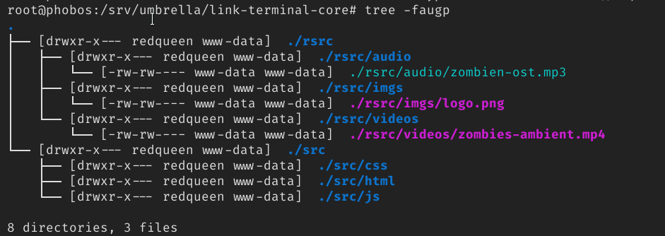

# Introducción

En esta tarea conjunta veremos algunos conceptos interesantes puestos todos juntos en la misma tarea con el objetivo de presentar al alumnado un entorno más parecido al mundo empresarial al que se van a incorporar. (Sí, con zombies incluidos).

Se pide una lectura atenta y detallada de las tareas que se deben realizar, con el objetivo de contemplar la tarea en su totalidad y asimilar cuáles serán los pasos que tendremos que ir implementando para conseguir el éxito que supone relacionar y poner en práctica todo lo aprendido en la realización de esta tarea.

Mucha suerte a tod@s.

\newpage

# Introducción Histórica

Cada uno de vosotros será el responsable de Comunicaciones de cada de las diferentes *sedes* de *Umbrella Corporation*, de ahora en adelante : *umbrella.corp*. Las instrucciones que se adjuntan son genéricas y plantean los diferentes retos que tod@s tenéis por hacer, los detalles en concreto de cada sede han sido cifrados y son accesibles en el nodo de **Reina Roja**, a.k.a: *redqueen.umbrella.corp*.

Vamos a valorar cada apartado de la realización de este pequeño simulacro de manera conjunta y será tenido en cuenta en todos los módulos implicados:

- Aplicaciones Web.
- Seguridad Informática.
- Servicios en Red.
- Sistemas Operativos Multiusuario y en Red.

Cada una de las partes de la práctica plantean una serie de ficheros/capturas/scripts, que deberán entregarse en Aules en una única entrega en el módulo de SOX. 

\newpage
# DNS y Bind9

Comenzaremos por la parte de resolución de nombres de dominio, la conexión inicial ha de ser con el nodo de *redqueen*, este nodo tiene la dirección IP:

```shell
192.168.5.100
```

Debéis de acceder al nodo y descargaros las instrucciones que os corresponden (cada uno tiene los mecanismos para descifrar la que le pertenece).

Para acceder a *redqueen*, deberéis realizar una reserva en vuestro DNS que apunte a la máquina `192.168.5.100` .  

La reserva debe ser del nombre:

| Nombre | IP |
|--------|----|
|redqueen.umbrella.corp|192.168.5.100|

Desde el Cliente Xubuntu se debe resolver redqueen.umbrella.corp sin problemas.

Una vez hecho eso deberéis acceder a la ruta:

```shell
http://redqueen.umbrella.corp/instructions/
```

Y descargar las instrucciones y descifrarlas...

# Bind9 - Entrega 01

Capturad la pantalla de vuestro navegador desde la máquina Xubuntu Cliente accediendo via DNS a la máquina del profesor (*redqueen*).

\newpage
# Elementos del mensaje de redqueen

En el fichero aparecen una serie de datos relacionados con la sede asignada, en el ejemplo:

```shell
DNS
core -> core.umbrella.corp
central -> central.core.umbrella.corp
terminal -> terminal.core.umbrella.corp
auxiliar -> auxiliar.core.umbrella.corp

NFS
link-redqueen-core
link-core
link-terminal-core

CRONTAB
copia central:/srv/backup-core -> lunes 03:00 , domingo 03:00
incremental -> central:/srv/backup-core-inc
```

# DNS

Se muestran los datos de la sede *core*, en la parte de DNS se debe realizar la configuración de la zona asignada, en el ejemplo sería :`core`. Toda la zona está bajo *umbrella.corp* como zona de dominio superior.

Lás máquinas que deben resolverse dentro de la zona asignada son:

| Máquina | Reserva DNS |
|---------|-------------|
| Ubuntu Server | central.core.umbrella.corp|
| Xubuntu Cliente | terminal.core.umbrella.corp|
| Windows Server | auxiliar.core.umbrella.corp|

Cada uno debe configurar su zona de manera adecuada. 

# DNS - Entrega

* Ficheros de zona, y configuración de la zona directa.
* Captura del comando `nslookup` ejecutado desde el Xubuntu Cliente consultando los tres nombres.

# NFS Server - Entrega

En la parte de NFS aparecen tres carpetas, que deben ser creadas y exportadas de la siguiente manera:

Estas carpetas han de ser creadas y exportadas desde el ordenador `central` de nuestra sede.

```shell
....
NFS
link-redqueen-core
link-core
link-terminal-core
....

```

- La carpeta `link-redqueen-core` ha de estar creada en la ruta `/srv/umbrella/link-redqueen-core` y ha de ser accesible por la máquina redqueen (que debe ser resoluble por nombre desde el servidor *central*), en *sólo lectura*. Y por todas las máquinas que estén en la red de `umbrella.corp`.
- La carpeta `link-core` ha de estar creada en la ruta `/srv/umbrella/link-core` y debe estar accesible por las máquinas de la red de nuestra sede. Además ha de estar montada en el arranque por parte de `terminal` y `auxiliar` en *sólo lectura*.
- La carpeta `link-terminal-core` ha de estar creada en la ruta `/srv/umbrella/link-terminal-core` y debe montarse *sólo por el ordenador `terminal` *en el arranque en **lectura y escritura**.

# NFS Server - Entrega

Entregar el fichero de `/etc/exports` del ordenador central de vuestra sede.

\newpage
# Scripting

La estructura de las carpetas que debe estar en la ruta del ordenador `central` : `/srv/umbrella/link-terminal-core/` ha de ser creada mediante un Script que deberéis adjuntar en la solución.

\

En la estructura de las carpetas se aprecia que aparecen unos usuarios determinados, en el script debéis crearlos, estableciendo su contraseña igual que el nombre del usuario:

```shell
redqueen:redqueen
```

El nombre del script ha de ser: `sox-replenish-nfs.sh`

---

Una vez ejecutado el script debemos situar en las rutas creadas los ficheros que aparecen en la captura. Podéis usar scp para pasarlos desde el ordenador *terminal* al *central*.

Los ficheros que deben establecerse en la carpetas dentro de `rsrc/`:

* zombien-ost.mp3
* logo.png
* zombies-ambient.mp4

Los podéis descargar de redqueen.umbrella.corp en la ruta:

```shell
http://redqueen.umbrella.corp/rsrc/
```

La banda sonora (ost) y el logo podéis sustituirlos por otros de vuestra elección siempre y cuando mantengáis el nombre en la ruta.

Y debéis programar un script que fije los permisos adecuados en los ficheros que acabáis de copiar. Recordad siempre que los permisos finales deben ser los que aparecen en la captura anterior. Este segundo script también debe ser entregado. 

El nombre del script ha de ser: `sox-fix-permissions.sh`, recordad que este script tan sólo ha de cambiar los permisos de los tres ficheros que acabamos de poner en las rutas, el resto de permisos deben ser establecidos con el anterior script.

# Scripting - Entrega

Entregad ambos scripts.

# NFS como cliente

En la máquina `terminal`, debéis preparar la carpeta de primer nivel:

```shell
/umbrella-corp/
```
que montará via `fstab` los dos directorios exportados en las rutas:

```shell
/umbrella-corp/terminal/
/umbrella-corp/core-files/
```

* El directorio `terminal` deberá montar la carpeta que tan sólo puede acceder el ordenador *terminal* de nuestra sede.
* El directorio `core-files` deberá montar la carpeta que todas las máquinas de nuestra sede pueden montar.

# NFS como cliente - Entrega

Debéis entregar el fichero `/etc/fstab` de la máquina Xubuntu.

\newpage
# HTML y CSS

Cada alumn@ ha recibido el nombre de la sede que le corresponde y tendrá que añadirlo a su pagina-panel de control.

En la ruta `/umbrella-corp/terminal/` deberán aparecer todos los ficheros y carpetas que se han creado y fijado en los scripts. Además esta ruta *local* debe ser usada en el HTML de César como ruta de los siguientes elementos (que deberán ser creados en caso de que no se hayan completado).

Recordad que debéis adaptar las rutas para que hagan referencia a vuestra sede, es decir, la ruta `core-files` deberá ser cambiada a `alaska-files`, etc.

| Tipo | Ruta | Texto que debe aparecer |
|:-----|:----|-----------------------:|
| a| file:///umbrella-corp/terminal/| Enlace privado |  
| a| file:///umbrella-corp/core-files/| Ficheros de la sede |
| a| http://redqueen.umbrella.corp/rsrc| Recursos desde la Reina Roja |
| a| http://redqueen.umbrella.corp/instructions| Reglas desde la Reina Roja |
| video | file:///umbrella-corp/terminal/rsrc/video/zombies-ambient.mp4 | <video>|  

Los enlaces al seguirlos mediante el navegador nos deben permitir navegar nuestro sistema de ficheros accediendo a las carpetas compartidas desde el ordenador central de nuestra sede.

Para comprobar esto último debéis pasar los ficheros a la máquina *terminal* de vuestra infraestructura.

\newpage
# Opcional : Apache

Servir mediante el servidor Web Apache la página-panel de control.

\newpage
# Copias de Seguridad y Crontab

Debes añadir al cron lo que sea necesario para que se realice una copia de seguridad de la carpeta /home de la máquina terminal los días y horas indicados en el fichero de instrucciones en la sección `CRONTAB`.

En esa misma sección encontrarás instrucciones que indican dónde realizar dicha copia así como dónde almacenar los incrementales correspondientes.

Según el fichero de ejemplo deberíamos almacenar una copia del directorio `/home` de la máquina *terminal.core.umbrella.corp* en el directorio `/srv/backup-core` de la máquina *central.core.umbrella.corp* y los incrementales se guardarían en el directorio `/srv/backup-core-inc` de la máquina *central.core.umbrella.corp*.


**PASO FINAL**

Una vez finalices la misión o cuando queden menos de 5 minutos para acabar
el tiempo, crea un documento de texto con las palabras **MISIÓN COMPLETADA** (en caso
de haber finalizado todos los pasos) o **MISIÓN FALLIDA** (en caso de que hayas
llegado al final sin completar alguno de los pasos). 

Cifra ese mensaje con la clave del master del nodo Reina Roja y sube el fichero encriptado a Aules.
