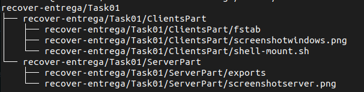

# June Recover Exam - 2022

\tableofcontents

## Introduction

In this exam you will use the infraestructure as being demanded in the previous file : *00-Infraestructure.pdf* that you can find in Aules, or in GitHub [here](https://github.com/aberlanas/SMX-SOX/blob/master/Unit0Z-Recover/00-Infraestructure.md).

Read *carefully* all the exam *before* starting the tasks.

The exam presentation (a *.zip* file), must contain several folders (one for each Task), and several subfolders (for each Task). For example, the Task01 folder must be as follows:

```shell
usuario@maquina~:$ tree -f recover-entrega/Task01
```

\

\newpage

## Task 01 - NFS (4 points)

### Server Part (1 point)

Configure the *nfs-kernel-server* in the *ubuntuserver.smx2022.net* in order to provide 3 remote mountpoints:

The mountpoints must serve the next folders:

 * `/srv/recover/allLan`
 * `/srv/recover/onlyWindows`
 * `/srv/recover/onlyXubuntu`

Please put into them, some *dummyfiles* to recreate a more *realistic* environment. The use of the `touch` command could be a good idea.

This folders (or mountpoints) must be configured in the next way:

| Mount point | Clients allowed | Operations |
|-------------|-----------------|------------|
| `allLan`      | 192.168.42.0/24 | Read Only  |
| `onlyWindows` | windowsclient.smx2022.net| Read and Write |
| `onlyXubuntu` | ubuntuclient.smx2022.net | Read and Write |

----

**Files to upload**

- nfs-kernel-server configuration file.
- screenshot of the tree -f command over the `/srv/recover/`.
- screenshot of the `showmount -e localhost` command output.
- screenshot of the `showmount -e ubuntuserver.smx2022.net` command output.

----

\newpage

### Clients Part (3 points) 

#### Windows 

Configure the Windows Client to connect to :

 - allLan
 - onlyWindows 

----

**Files to upload**

- Screenshot of the mounted directories.

----

#### GNU/LinuX

Configure the Xubuntu Client to mount :

 - allLan
 - onlyXubuntu 

On the next folders:

`allLan`-> `/smx2022/allLan`
`onlyXubuntu`  -> `/smx2022/private`

This must be performed on the boot process of the machine, using the *fstab* file. 

To prevent a critical system failure, create a ShellScript that makes the next actions:

* All the actions of the script must show a progress message.
* Check if the user that launchs the script has root privileges.
* Check if the client folders exists, and if not create them.
* Check if the servermachine is *available* using `ping`.
* Check if the mountpoints are already mounted and umount them.
* Using the `mount -a` command, let the system ready to be used.

----

**Files to upload**

- Screenshot of the mounted directories.
- The shellScript.
- The fstab file.

----

\newpage
## Task 02 - OpenLDAP (4 points)

### Server Part (2 points)

Configure the *openldap* server in the *ubuntuserver.smx2022.net* to be access from a web-browser by the client at:

 - http://ubuntuserver.smx2022.net/phpldapadmin

You can use the guide from the Moodle Course (SMX-SOX). But remember that the exam assumes that:

- You can *resolve by name* the server.
- You has correctly installed the slapd daemon, the apache and the phpldapadmin.
- **Some** of the changes must be:

Original

|  Key | Original from this course |
|------|---------------------------|
| ldap_search_base | dc=ubuntusrv,dc=smx2021,dc=net|
| ldap_uri |dc=ubuntusrv,dc=smx2021,dc=net|
| ldap_default_bind_dn|  cn=admin,dc=ubuntusrv,dc=smx2021,dc=net | 
| ldap_user_search_base|  cn=goblins,dc=ubuntusrv,dc=smx2021,dc=net| 

Recover Exam

| Key | Recover Exam |
|-----|--------------|
|ldap_search_base |dc=ubuntuserver,dc=smx2022,dc=net|
|ldap_uri| dc=ubuntuserver,dc=smx2022,dc=net|
|ldap_default_bind_dn| cn=admin,dc=ubuntuserver,dc=smx2022,dc=net| 
|ldap_user_search_base| cn=recover,dc=ubuntuserver,dc=smx2022,dc=net |

These are only few examples, you must configure *correctly* the LDAP and the PHPLdapAdmin.

Create a new cn:

- `cn=recover,dc=ubuntuserver,dc=smx2022,dc=net`

And 2 users inside this cn:

- adrian
- erik

And configure the `$HOME` directory in the path:

- `/home/recover/$USER`
  
----

**Files to upload**

- the sssd configuration file: `/etc/sssd/sssd.conf`
- screenshot of the webbrowser listing the users. 

----

### Clients Part (2 points)

Configure the *ldap client* in the *ubuntuclient.smx2022.net* to allow the users recently created on the server make a Graphical Login using lightdm:

 ----

**Files to upload**

- Two Screenshots (one for each user) of a successful graphical session.
- Two Screenshots (one for each user) that shows the output from the execution of : `pwd` command in a `xfce4-terminal` .

----

\newpage
## Task 03 : Scripting : Randomizer (2 points)

Choose one, PowerShell or BASH and create an script that using arguments, generate several random numbers (simulating a *dice tower*) and show the results to the user.

The behaviour is the next:

- The first argument set the number of dice faces that has the dice.
- The second argument set the number of dices of this number of faces given.
- The third argument set the minimun  result in the dice throwing that results in a success. 

For each dice, if the number is greater or equal to the number given as success, the output must concatenate a "\*".

At the end of the dice output, show the number of success given.

The output must show all the results.

Example over Windows:

```PowerShell

C:\Users\winadmin\Escritorio\randomizer.ps1 6 3 4
- Dice 1: 3
- Dice 2: 2
- Dice 3: 5 *
-------
Success: 1

```

Example over GNU/LinuX:

```Shell
linadmin@ubuntuclient.smx2022.net:~$randomizer.sh 6 3 3
- Dice 1: 3 *
- Dice 2: 2
- Dice 3: 5 *
-------
Success: 2
```

The script must check that the arguments are numbers and are only 2 arguments.

**Files to upload**

- The Script.

----